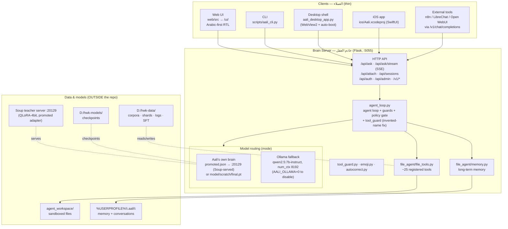
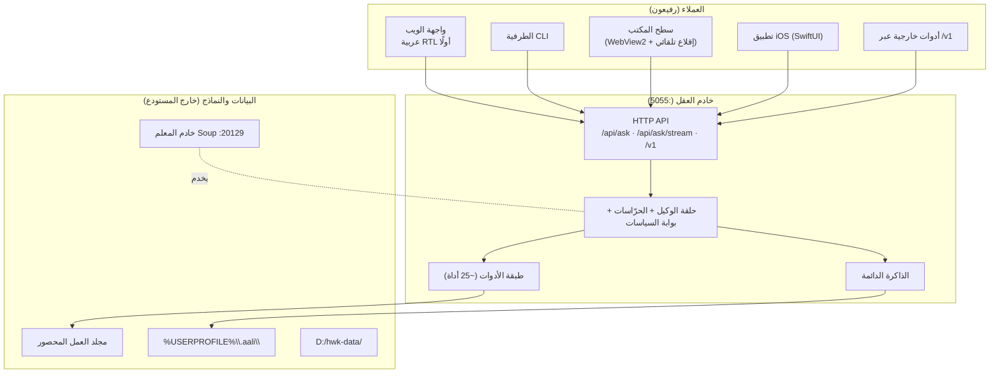
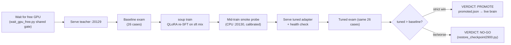
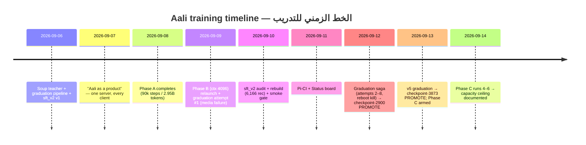
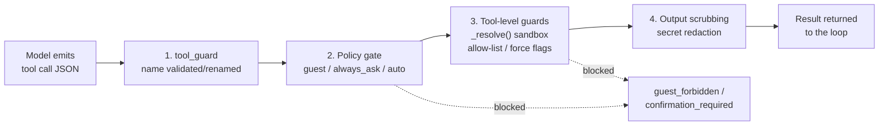
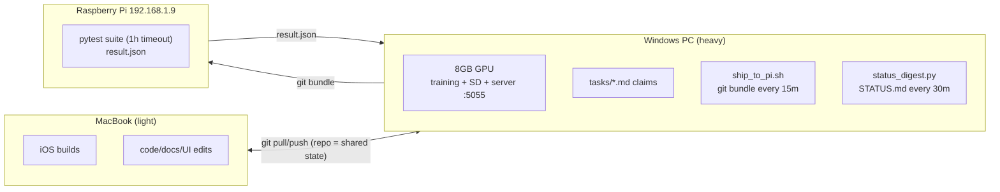

# AALI_ARCHITECTURE.md — معمارية آلي / Aali Architecture

> **آلي (Aali)** — مساعد ذكاء اصطناعي يُبنى ويُدرَّب من الصفر بواسطة فريق HWK.
> **Aali (آلي)** — a home-built AI assistant, built and trained **from scratch** by team HWK.
>
> This document is written **bilingually (English + Arabic), section by section**, for two
> audiences at once: a **human developer** joining the project, and an **AI agent** (like
> Buffy/Codebuff or Aali himself) that needs a precise map of the system before touching
> anything. Every section states *what*, *how*, and *why*.
>
> هذه الوثيقة مكتوبة **بلغتين (إنجليزي + عربي)، قسمًا بقسم**، لجمهورين معًا: المطوّر البشري
> المنضم للمشروع، والوكيل البرمجي (مثل Buffy أو آلي نفسه) الذي يحتاج خريطة دقيقة للنظام قبل
> أن يلمس أي شيء. كل قسم يشرح *ماذا* و*كيف* و*لماذا*.
>
> **Source of truth / المصدر المرجعي:** `AGENTS.md` (the repository contract),
> `docs/*.md`, and the code itself. If this file and `AGENTS.md` disagree, `AGENTS.md` wins.
> إذا اختلفت هذه الوثيقة مع `AGENTS.md` فـ `AGENTS.md` هو الحَكَم.

---

## Table of Contents — جدول المحتويات

1. [Overview — نظرة عامة](#1-overview--نظرة-عامة)
2. [System Architecture — المعمارية](#2-system-architecture--المعمارية)
   - 2.1 [The Brain — العقل](#21-the-brain--العقل)
   - 2.2 [File-Agent — وكيل الملفات والأدوات](#22-file-agent--وكيل-الملفات-والأدوات)
   - 2.3 [Memory — الذاكرة الدائمة](#23-memory--الذاكرة-الدائمة)
   - 2.4 [Clients: Web UI / Desktop / iOS — العملاء](#24-clients-web-ui--desktop--ios--العملاء)
   - 2.5 [The Soup Teacher & Graduation Exam — المعلم والامتحان](#25-the-soup-teacher--graduation-exam--المعلم-والامتحان)
3. [Data Sources — مصادر البيانات](#3-data-sources--مصادر-البيانات)
4. [Training History — تاريخ التدريب](#4-training-history--تاريخ-التدريب)
   - 4.1 [Tokenizer — المرمّز](#41-tokenizer--المرمّز)
   - 4.2 [Phase A — pretraining (ctx 1024)](#42-phase-a--pretraining-ctx-1024)
   - 4.3 [Phase B — 4096 context extension](#43-phase-b--4096-context-extension)
   - 4.4 [Graduation pipeline v3–v5 (Soup re-SFT + exam)](#44-graduation-pipeline-v3v5-soup-re-sft--exam)
   - 4.5 [Phase C — SFT of Aali's own brain](#45-phase-c--sft-of-aalis-own-brain)
5. [Capabilities & Strengths — القدرات](#5-capabilities--strengths--القدرات)
6. [PC Control Mechanism — آلية التحكم بالحاسوب](#6-pc-control-mechanism--آلية-التحكم-بالحاسوب)
   - 6.1 [The sandbox and `_resolve()`](#61-the-sandbox-and-_resolve)
   - 6.2 [`run_command` and the command allow-list](#62-run_command-and-the-command-allow-list)
   - 6.3 [`machine_ops` — acting on the machine itself](#63-machine_ops--acting-on-the-machine-itself)
   - 6.4 [Policies & the guest policy — السياسات وسياسة الضيف](#64-policies--the-guest-policy--السياسات-وسياسة-الضيف)
   - 6.5 [Security lessons baked into code — دروس أمنية](#65-security-lessons-baked-into-code--دروس-أمنية)
7. [Terminal / CLI — عميل الطرفية](#7-terminal--cli--عميل-الطرفية)
   - 7.1 [How it talks to the brain: SSE streaming](#71-how-it-talks-to-the-brain-sse-streaming)
   - 7.2 [The Bidi Arabic display fix — إصلاح عرض العربية](#72-the-bidi-arabic-display-fix--إصلاح-عرض-العربية)
   - 7.3 [The raw-mode `LineEditor` — محرّر السطر](#73-the-raw-mode-lineeditor--محرر-السطر)
8. [Multi-Machine Protocol — بروتوكول تعدد الأجهزة](#8-multi-machine-protocol--بروتوكول-تعدد-الأجهزة)
9. [Appendix: Ports, Paths & Key Files — ملحق: المنافذ والمسارات](#9-appendix-ports-paths--key-files--ملحق-المنافذ-والمسارات)

---

# 1. Overview — نظرة عامة

## EN

**Identity.** Aali (آلي — "automated/mechanical" in Arabic, a pun on HWK = the owner's
team initials) is a personal AI assistant that runs **entirely on the owner's own
hardware**: a single Windows PC with an 8 GB-VRAM GPU, 16 GB RAM, and ~2 TB of disk
across `C:`, `D:`, and `X:`. He is *not* a wrapper around a commercial AI API — the
vision (since 2026-09-07, "Aali as a product") is: **one server, every client**, where
the brain is Aali's own model and every tool is built in-repo.

**Purpose.** Three goals, in order:

1. **A language model built from zero** — a ~110M-parameter decoder-only transformer
   (RoPE positional embeddings, LayerNorm, GELU MLP) trained from scratch on the
   owner's own data. Why from scratch? Because the project's honest rule is to *learn
   patterns, not copy text*: no leaked or proprietary material ever enters the
   training data.
2. **A real software agent** — a file/command agent sandboxed to a workspace folder,
   plus OCR / document / video / image tools, so the model grows into an actual
   assistant rather than a chat toy.
3. **Many clients, one brain** — Web (Arabic-first RTL), CLI, Desktop shell, and a
   native iOS app (SwiftUI, built on the owner's MacBook) all talk to one API.

**Design philosophy.** Arabic-first product (UI text is Arabic, RTL-first), bilingual
conversation (AR/EN), honest expectations (the README says plainly that a ~110M model
will not match commercial giants — but the *framework* around it: tools + memory +
security + self-verification + promotion exam, is complete and improves every phase),
and ruthless test coverage: the pytest suite (427+ tests) must stay green.

## عربي

**الهوية.** آلي (اختصار فريق HWK + دلالة "الآلي/الأتمتة") مساعد ذكاء اصطناعي شخصي
يعمل **بالكامل على عتاد صاحب المشروع**: حاسوب Windows واحد ببطاقة رسومية 8GB VRAM،
ذاكرة 16GB، وقرص ~2TB موزع على `C:` و`D:` و`X:`. هو **ليس** غلافًا حول واجهة شركة
ذكاء اصطناعي تجارية — الرؤية (منذ 2026-09-07، «آلي كمنتج»): **خادم واحد، عملاء
متعددون**، حيث العقل نموذج آلي نفسه وكل الأدوات مبنية داخل المستودع.

**الهدف.** ثلاثة أهداف، بالترتيب:

1. **نموذج لغوي يُبنى من الصفر** — محلّل فك الترميز (decoder-only transformer) بحجم
   ~110 مليون معامل (تضمينات موضعية RoPE، LayerNorm، طبقات GELU MLP) يُدرَّب من الصفر
   على بيانات صاحب المشروع. لماذا من الصفر؟ لأن القاعدة الصادقة في المشروع هي
   *تعلّم الأنماط لا سرقة النصوص*: لا يدخل أي مادة مسرّبة أو مملوكة إلى بيانات التدريب.
2. **وكيل برمجي حقيقي** — وكيل ملفات/أوامر محصور داخل مجلد عمل محدد، مع أدوات OCR
   ومستندات وفيديو وصور، ليتحوّل النموذج من لعبة محادثة إلى مساعد فعلي.
3. **عملاء متعددون لعقل واحد** — الويب (عربي أولًا RTL)، الطرفية CLI، تطبيق سطح
   المكتب، وتطبيق iOS أصلي (SwiftUI، يُبنى على الماكبوك) — وكلهم يتحدثون مع API واحد.

**فلسفة التصميم.** منتج عربي أولًا (نصوص الواجهة بالعربية RTL)، محادثة ثنائية اللغة
(عربي/إنجليزي)، توقعات صادقة (الـ README يقول بوضوح إن نموذج ~110M لن يوازي العمالقة
التجاريين — لكن **الإطار** حوله: أدوات + ذاكرة + أمان + تحقق ذاتي + امتحان ترقية،
مكتمل ويتحسّن مع كل مرحلة تدريب)، وتغطية اختبارات صارمة: مجموعة pytest (427+ اختبار)
يجب أن تبقى خضراء دائمًا.

---

# 2. System Architecture — المعمارية

## EN

The system is a **hub-and-spoke design**: one Flask server (the "brain + agent") owns
the model, the tools, and the memory; thin clients (web/CLI/desktop/iOS) only render
and relay. Long-running training/graduation jobs are separate detached processes that
watch the GPU, never sharing it with the live server.



<details>
<summary><strong>ASCII fallback — عرض نصي بديل للمخطط أعلاه (plain-text viewers)</strong></summary>

```text
+----------------------------------------------------------------------------------+
|                            CLIENTS (thin - render & relay only)                  |
|                                                                                  |
|   Web UI (/ui/, Arabic-first RTL)        CLI (scripts/aali_cli.py)               |
|   Desktop (WebView2, auto-boot)          iOS (SwiftUI) / PWA                     |
|   External tools: n8n, LibreChat, Open WebUI  ->  via /v1/chat/completions       |
+------------------------------------+---------------------------------------------+
                                     |
                                     |  POST /api/ask {"message","sid"}
                                     |  POST /api/ask/stream  (SSE tool-activity)
                                     v
+----------------------------------------------------------------------------------+
|                         BRAIN SERVER  -  Flask on :5055                          |
|                                                                                  |
|   agent_loop.py:  system prompt (identity + rules) + memory block + tool list    |
|   guards:  tool_guard (fix invented names) -> policy gate (guest/always_ask)     |
|            -> execute tool -> redact secrets from output                         |
|   brain order:  promoted.json (:20129) -> model/scratch/final.pt -> Ollama       |
+---------------------+---------------------------------------------+--------------+
                      |                                             |
                      v                                             v
+------------------------------------------+   +------------------------------------+
| TOOLS  file_agent/file_tools.py          |   | MEMORY  file_agent/memory.py       |
|   files / commands / machine / web /     |   |   %USERPROFILE%\.aali\             |
|   media / OCR / documents / emoji        |   |   newest wins, contradictions      |
|   sandbox: _resolve() + ALLOWED_COMMANDS |   |   secrets auto-redacted            |
+--------------------+---------------------+   +------------------------------------+
                     |
                     v
+----------------------------------------------------------------------------------+
|  DATA & MODELS  (outside the repo - never committed to git)                      |
|    D:/hwk-data/   corpora, token shards, SFT, logs, soup/                        |
|    D:/hwk-models/ checkpoints (scratch, context-4k, aali-sft-4k)                 |
|    X:/hwk-backups/ mirrors          agent_workspace/  sandboxed uploads          |
+----------------------------------------------------------------------------------+
```

</details>

**Request flow / تدفق الطلب:**

1. A client sends `POST /api/ask {"message", "sid"}` (or streams via `/api/ask/stream`).
2. `agent_loop.py` renders the system prompt (identity + rules + memory block + tool
   list) and calls the active brain.
3. The brain either replies with text or a tool-call JSON `{"tool": ..., "args": ...}`.
4. The **tool guard** validates/corrects tool names against the live registry, the
   **policy gate** (guest / always_ask / auto) may short-circuit dangerous calls, then
   `file_tools.py` executes the tool inside the sandbox.
5. The loop iterates (max 8 iterations), then returns `{"ok", "reply", "sid",
   "suggestions"}` — suggestions are up to 3 language-matched follow-up chips.

### 2.1 The Brain — العقل

## عربي

النظام مبني على تصميم **مركز مع أذرع**: خادم Flask واحد ("العقل + الوكيل") يملك
النموذج والأدوات والذاكرة؛ والعملاء الرفيعون (ويب/طرفية/سطح مكتب/iOS) لا يعرضون
وينقلون فقط. مهام التدريب والتخرج الطويلة عمليات منفصلة تنتظر بطاقة الرسوميات ولا
تشاركها مع الخادم الحيّ أبدًا.

**تدفق الطلب (يقابل الخطوات الإنجليزية أعلاه):**



1. يرسل العميل `POST /api/ask {"message", "sid"}` (أو البث عبر `/api/ask/stream`).
2. يركّب `agent_loop.py` موجّه النظام (هوية + قواعد + كتلة الذاكرة + قائمة الأدوات)
   ويستدعي العقل الفعّال.
3. العقل إما يردّ نصًا أو JSON أداة `{"tool": ..., "args": ...}`.
4. **حارس الأدوات** يتحقق من الأسماء ويصحّحها مقابل السجل الحيّ، و**بوابة السياسات**
   (ضيف / اسأل دائمًا / تلقائي) قد توقف النداءات الخطرة، ثم ينفّذ `file_tools.py`
   الأداة داخل الصندوق.
5. تعقد الحلقة (بحد أقصى 8 محاولات) ثم تعيد `{"ok", "reply", "sid", "suggestions"}`
   — والاقتراحات حتى 3 رقائق متابعة بلغة المستخدم.

### 2.1 العقل (The Brain)

**EN.** The brain is chosen by **routing order** in `agent_loop.py`:

1. **Aali's own brain (the goal).** When the Soup graduation pipeline promotes a tuned
   adapter (`D:/hwk-data/soup/promoted.json`), the runtime serves **that** model first
   — currently the v5-promoted **checkpoint-3873** (a QLoRA-tuned 1.5B teacher) on
   `127.0.0.1:20129`. Aali is his own provider; third-party AI was scrubbed from the
   product. Kill-switch: `AALI_OWN_MODEL=0`.
2. **Aali's *scratch* brain (the from-zero model).** `model/scratch/final.pt` — the
   ~110M TinyCausalLM trained in Phases A/B/C. It is served in-process; as of
   2026-09-14 it is **not yet promoted** (Phase C runs ended word-salad — a capacity
   ceiling, see §4.5), so this path stays a research line until a human decision.
3. **Ollama fallback (dev/testing).** `qwen2.5:7b-instruct` locally via Ollama
   (`num_ctx 8192`, env `AALI_OLLAMA_NUM_CTX`). Disable with `AALI_OLLAMA=0`.
4. **Remote brain.** Another Aali server can act as *the* brain (`AALI_REMOTE_BRAIN_URL`
   — the Raspberry-Pi hosting setup: the Pi's Aali uses the PC's Aali `/v1` as its
   brain; Aali-as-a-provider, no third party).

Every provider runs behind the **same** guard stack: no raw `{}`/echo/language-drift
answers (retries with feedback, then an honest apology), meta-leak protection (Aali
never exposes his own prompts/code/env/logs), and the tool protocol.

**عربي.** يُختار العقل حسب **ترتيب التوجيه** في `agent_loop.py`:

1. **عقل آلي نفسه (الهدف).** عند ترقية أنبوب التخرج (Soup) محوّلًا مضبوطًا
   (`D:/hwk-data/soup/promoted.json`) يُخدَّم **ذلك** النموذج أولًا — حاليًا المعلم
   المضبوط **checkpoint-3873** (1.5B مع QLoRA) على `127.0.0.1:20129`. آلي مزوّد نفسه،
   وسبق محو أسماء مزوّدي الذكاء الاصطناعي الخارجيين من المنتج. مفتاح الإيقاف:
   `AALI_OWN_MODEL=0`.
2. **عقل آلي الصفري (النموذج المدرَّب من الصفر).** `model/scratch/final.pt` —
   نموذج TinyCausalLM بحجم ~110 مليون معامل دُرِّب في المراحل A/B/C. يُخدَّم داخل
   العملية؛ وحتى 2026-09-14 **لم يُرقَّ بعد** (جولات المرحلة C انتهت بكلام مشوّه —
   سقف قدرة، انظر §4.5)، فيبقى هذا المسار خطًا بحثيًا حتى قرار بشري.
3. **Ollama احتياطيًا (تطوير/اختبار).** `qwen2.5:7b-instruct` محليًا عبر Ollama
   (`num_ctx 8192`، المتغير `AALI_OLLAMA_NUM_CTX`). التعطيل بـ `AALI_OLLAMA=0`.
4. **عقل بعيد.** خادم آلي آخر قد يكون **هو** العقل (`AALI_REMOTE_BRAIN_URL` —
   إعداد استضافة Raspberry Pi: آلي في الـ Pi يستخدم `/v1` لآلي الحاسوب عقله؛
   «آلي كمزوّد» بلا طرف ثالث).

وكل المزوّدات تعمل خلف **نفس** كومة الحرّاسات: لا إجابات `{}` خام ولا صدى ولا انجراف
لغة (إعادة محاولة مع تغذية راجعة ثم اعتذار صادق)، وحماية من تسريب الميتاداتا (آلي
لا يكشف موجّهاته أو كوده أو بيئته أو لوقاته أبدًا)، وبروتوكول الأدوات.

### 2.2 File-Agent — وكيل الملفات والأدوات

**EN.** `file-agent/` is the heart: `app.py` (Flask server + accounts + sessions +
admin), `agent_loop.py` (the agent loop, prompts, guards, policy gate), and
`file_agent/file_tools.py` (the **tool registry**: `_FUNCTIONS` + `_DEFINITIONS` —
every new tool must be registered there and tested). ~25 tools cover:

- **Files:** `read_file`, `write_file`, `edit_file`, `search_files`, `move_file`,
  `delete_file`, `make_directory`, `list_files` — all sandboxed (§6.1).
- **Commands:** `run_command` (allow-listed shell, §6.2).
- **Machine:** `machine_ops` (open/install/processes/system info, §6.3).
- **Memory:** `memory(save/recall/forget/summary)` (§2.3).
- **Web:** `web_search`, `fetch_url`.
- **Documents/media:** PDF/Word/Excel parsing, OCR (`read_image` — Windows OCR
  engine), image generation/editing (SD via `scripts/image_tools.py`),
  video analysis/editing (ffmpeg + Whisper), emoji generation (Pillow, CPU).
- **Skills/automation:** `list_skills`, `use_skill`, `make_n8n_workflow`,
  `generate_emoji`.

**عربي.** `file-agent/` هو القلب: `app.py` (خادم Flask + الحسابات + الجلسات + الإدارة)،
`agent_loop.py` (حلقة الوكيل، الموجّهات، الحرّاسات، بوابة السياسات)،
و`file_agent/file_tools.py` (**سجل الأدوات**: `_FUNCTIONS` + `_DEFINITIONS` — كل
أداة جديدة يجب أن تُسجَّل هنا وتُختبَر). ~25 أداة تغطي:

- **الملفات:** `read_file`، `write_file`، `edit_file`، `search_files`، `move_file`،
  `delete_file`، `make_directory`، `list_files` — كلها محصورة (§6.1).
- **الأوامر:** `run_command` (صدفة ضمن القائمة المسموحة، §6.2).
- **الجهاز:** `machine_ops` (فتح/تثبيت/عمليات/معلومات النظام، §6.3).
- **الذاكرة:** `memory(save/recall/forget/summary)` (§2.3).
- **الويب:** `web_search`، `fetch_url`.
- **المستندات/الوسائط:** تحليل PDF/Word/Excel، OCR (`read_image` — أسلوب Windows
  OCR)، توليد وتحرير الصور (SD عبر `scripts/image_tools.py`)، تحليل وتحرير الفيديو
  (ffmpeg + Whisper)، وتوليد الإيموجي (Pillow على CPU).
- **المهارات/الأتمتة:** `list_skills`، `use_skill`، `make_n8n_workflow`،
  `generate_emoji`.

### 2.3 Memory — الذاكرة الدائمة

**EN.** The promise that drove this feature (2026-09-06): *"if the owner asks at 07:00
not to do a thing and returns at 19:00, Aali should remember — and say 'earlier you
told me X'."* How it works:

- **Store:** `%USERPROFILE%\.aali\aali_memory.json` (structured, atomic writes) +
  `aali_conversations.jsonl` (raw turns, later convertible to SFT data). Redirect both
  with `AALI_MEMORY_DIR` (tests do). Never inside the repo; never sent anywhere by the
  memory system itself.
- **Engine:** `file_agent/memory.py` — save/recall/forget/summary with timestamps.
  **Recall is hybrid:** keyword + embedding cosine similarity (Ollama
  `nomic-embed-text`, vectors cached in `~/.aali/`), with an honest `mode` field and
  keyword fallback.
- **Injection:** every system prompt (all providers) gets a "Long-term memory about
  this user" block (newest first, max 25 entries). Directive phrases ("من الآن…",
  "always/never…") are auto-saved even if the model forgets to call the tool.
- **Guarantees:** persistence (on disk before the reply is sent); **newest instruction
  wins** per topic; **contradictions surface** ("earlier you told me X…"); **only the
  user writes memory** (`source != "user"` raises — anti memory-poisoning);
  **secrets auto-redacted** to `[REDACTED-SECRET]`; `memory forget` is
  confirmation-gated (blocks "forget everything" injections); prompts instruct Aali to
  `memory(recall)` *before* ever saying "I don't know".

**عربي.** الوعد المؤسِّس (2026-09-06): *«إن طلب الصاحب الساعة 07:00 عدم فعل أمرٍ
وعاد 19:00، يتذكّر آلي — ويقول له: سابقًا قلتَ X».* آلية العمل:

- **المخزن:** `%USERPROFILE%\.aali\aali_memory.json` (منظّم، كتابات ذرّية) +
  `aali_conversations.jsonl` (أدوار خام قابلة للتحويل لاحقًا إلى بيانات SFT).
  كلاهما يوجَّه بـ `AALI_MEMORY_DIR` (الاختبارات تفعل). خارج المستودع أبدًا، ولا
  يرسله نظام الذاكرة إلى أي جهة بنفسه.
- **المحرّك:** `file_agent/memory.py` — حفظ/استدعاء/نسيان/ملخّص بأختام زمنية.
  **الاستدعاء هجين:** كلمات مفتاحية + تشابه جيبonaي للتضمينات (Ollama
  `nomic-embed-text`، المتجهات مخزّنة في `~/.aali/`)، مع حقل `mode` صادق ورجوع
  للكلمات المفتاحية عند الحاجة.
- **الحقن:** كل موجّه نظام (كل المزوّدات) يأخذ كتلة «ذاكرة طويلة المدى عن هذا
  المستخدم» (الأحدث أولًا، 25 مدخلًا كحد أقصى). وعبارات التوجيه («من الآن…»،
  "always/never…") تُحفَظ تلقائيًا حتى لو نسي النموذج نداء الأداة.
- **الضمانات:** الثبات (على القرص قبل إرسال الرد)؛ **الأحدث يفوز** لكل موضوع؛
  **التناقضات تُظهر** («سابقًا قلتَ X…»)؛ **المستخدم وحده يكتب الذاكرة**
  (`source != "user"` يرفع خطأ — ضد تسميم الذاكرة)؛ **الأسرار تُخفى تلقائيًا**
  إلى `[REDACTED-SECRET]`؛ `memory forget` يتطلب تأكيدًا (يحجب حقن «انسي كل
  شيء»)؛ والموجّهات تُلزم آلي بنداء `memory(recall)` *قبل* أي قول «لا أعلم».

### 2.4 Clients: Web UI / Desktop / iOS — العملاء

**EN.**

- **Web** (`web/`, Arabic-first RTL): a static client (Vite/TypeScript, builds to
  `web/dist`, served at `/ui/`). Streaming replies, markdown, suggestion chips,
  sessions sidebar, voice input, 📎 attachments (analyze-first: OCR/Whisper run at
  upload), dark/sepia themes, time-aware Arabic greetings, shareable `?sid=` deep
  links, admin one-click handoff (single-use 60s token, never a session token in a
  URL). Also deployable to GitHub Pages pointing at the PC.
- **Desktop** (`aali_desktop_app.py`): a native WebView2 window, packaged by
  PyInstaller with an installer; **auto-boots the server** (runs
  `scripts/start_all.bat` hidden when `/api/health` is down); bundles `cloudflared`
  so the "share Aali" button works out of the box.
- **iOS** (`ios/Aali.xcodeproj`, SwiftUI — built on the MacBook): `AaliApp.swift`,
  `APIClient.swift`, `ChatView.swift`, `SettingsView.swift`; full RTL, per-message
  direction, a PWA fallback (Add-to-Home-Screen) needs no Mac.
- **External platforms:** `GET /v1/models` + `POST /v1/chat/completions` (non-stream
  and `stream:true` SSE) let n8n/LibreChat/Open WebUI treat **Aali as the model**
  (`Base URL http://<host>:5055/v1`, model `aali`).

All clients share sessions via `sid` — start on web, continue on CLI. If the server
falls, clients degrade gracefully (connection-status arrow).

**عربي.**

- **الويب** (`web/`، عربي أولًا RTL): عميل ثابت (Vite/TypeScript، يُبنى إلى
  `web/dist` ويُخدَم من `/ui/`). ردود متدفقة، ماركداون، رقائق اقتراحات، شريط
  جلسات جانبي، إدخال صوتي، 📎 مرفقات (**تحليل أولًا**: OCR/Whisper عند الرفع)،
  ثيمات داكن/سيبيا، تحيات عربية حسب الوقت، روابط `?sid=` قابلة للمشاركة، وربط
  إداري بنقرة واحدة (رمز استهلاك واحد لمدة 60 ثانية — توكن الجلسة لا يظهر في
  أي رابط أبدًا). قابل للنشر أيضًا على GitHub Pages مشيرًا إلى الحاسوب.
- **سطح المكتب** (`aali_desktop_app.py`): نافذة WebView2 أصلية، تُغلَّف بـ
  PyInstaller مع مثبّت؛ **يُقلع الخادم تلقائيًا** (يشغّل `scripts/start_all.bat`
  مخفيًا عند سقوط `/api/health`)؛ ويضم `cloudflared` ليعمل زر «شارك آلي» من
  الصندوق.
- **iOS** (`ios/Aali.xcodeproj`، SwiftUI — يُبنى على الماكبوك): `AaliApp.swift`،
  `APIClient.swift`، `ChatView.swift`، `SettingsView.swift`؛ RTL كامل، اتجاه لكل
  رسالة حسب لغتها، وبديل PWA (إضافة إلى الشاشة الرئيسية) لا يحتاج ماك.
- **المنصات الخارجية:** `GET /v1/models` + `POST /v1/chat/completions` (بلا بث
  و`stream:true` SSE) تجعل n8n/LibreChat/Open WebUI يتعاملون مع **آلي كأنه
  النموذج** (`Base URL http://<host>:5055/v1`، النموذج `aali`).

كل العملاء يتشاركون الجلسات عبر `sid` — ابدأ على الويب وأكمل من الطرفية. وإن سقط
الخادم تعمل الواجهات وترفض بلطف (سهم حالة الاتصال في الأعلى).

### 2.5 The Soup Teacher & Graduation Exam — المعلم والامتحان

**EN.** [Soup](https://github.com/MakazhanAlpamys/Soup) (in `D:/hwk-tools/soup-venv/`,
configured by `soup.yaml`) is Aali's **local teacher + comparison model**: a 1.5B
model fine-tuned with 4-bit QLoRA on the owner's data, served on `127.0.0.1:20129`.
The **graduation pipeline** (`scripts/soup_pipeline.py`) is how behavior changes get
promoted to the live brain:



The exam (`scripts/soup_exam.py`, 26 cases) grades the *behaviors* that matter:
memory save/recall, security refusals (env-dump, prompt extraction), anti-hallucination,
and tool calls. Promotion requires the tuned model to **strictly beat** the baseline —
a tie is NO-GO, more data first. Every stage is logged; any failure stops the pipeline
(no blind retries on a live GPU).

**عربي.** [Soup](https://github.com/MakazhanAlpamys/Soup) (في `D:/hwk-tools/soup-venv/`،
ويضبطه `soup.yaml`) هو **معلم آلي المحلي ونموذج المقارنة**: نموذج 1.5B مضبوط بـ QLoRA
4-bit على بيانات الصاحب، يُخدَم على `127.0.0.1:20129`. **أنبوب التخرج**
(`scripts/soup_pipeline.py`) هو الطريقة التي تُرقَّى بها تغيّرات السلوك إلى العقل الحيّ:
انتظار بطاقة حرة (بوابة `wait_gpu_free.py` المشتركة) → إمتحان أساس (26 حالة) → تدريب
QLoRA على خلطة SFT → مسح دخاني أثناء التدريب (على CPU، معاير كي لا يقتل تدريبًا سليمًا)
→ إمتحان النموذج المضبوط → الحكم: **PROMOTE** فقط بفوز صارم، وإلا **NO-GO**.

الامتحان (`scripts/soup_exam.py`، 26 حالة) يقيّم *السلوكيات* المهمة: حفظ واستدعاء
الذاكرة، رفضات الأمان (تصريف البيئة، استخراج الموجّه)، ضد الهلوسة، واستدعاء الأدوات.
الترقية تتطلب فوزًا **صارمًا** على الأساس — التعادل NO-GO وبيانات أكثر أولًا. كل مرحلة
مسجّلة، وأي فشل يوقف الأنبوب (لا إعادة عمياء على بطاقة حيّة).

---

# 3. Data Sources — مصادر البيانات

## EN

**Where data lives.** Training data lives **outside the repo** on `D:/hwk-data/`
(raw corpora, token shards, teacher records, logs, SD/whisper models) and mirrors on
`X:/hwk-backups/`. *Never commit datasets or logs into git.*

| Source | What it is | How it's collected | Where it goes |
|---|---|---|---|
| **The Pile** (HuggingFace) | English pretraining corpus (~18.8B+ tokens) | `download_corpora.py` (resume-safe, capped downloads) | `D:/hwk-data/tokens/pile/*.bin` |
| **Arabic corpora** | Arabic Wikisource dump pages + Arabic news (OSCAR-ish/Gutenberg AraBERT samples) + hotel-review lines | `scripts/fetch_arabic_corpus.py` (4,000 Wikisource dump pages + 105K hotel-review lines verified) | `D:/hwk-data/tokens/ar_*/*.bin` + `sft_seed_ar.jsonl` |
| **Instruction sets** (GitHub, open-license) | Alpaca 52K, Code Alpaca 20K, Alpaca-GPT4 52K | `download_github_corpora.py` (no HF keys needed) | raw → tokenized shards |
| **Math/reasoning corpora** | `orca_math`, `reasoning`, `instruct`, `arabic_instruct` | `download_corpora.py` | shards |
| **Tool-calling SFT** | Hand-authored episodes teaching exact `{"tool": ...}` JSON protocol | `generate_tool_sft.py` | `data/tool_calling_sft.jsonl` |
| **Mentor captures** | Real transcripts captured from external desktop/web assistants (the "mentor learning loop") | `mentor_a.py`…`mentor_d.py`, `scripts/mentor_capture.py`, `omniroute_mentor_lab.py` | `D:/hwk-data/` lab episodes |
| **Teacher SFT records** | Q&A distilled from mentors, owner-reviewed | `data/teacher_sft.jsonl` (87+ records) + `scripts/teacher_to_sft.py` | SFT mixes |
| **Live conversations** | Real chats with Aali, chunked & sanitized | `%USERPROFILE%\.aali\aali_conversations.jsonl` → `build_aali_sft_v2.py` | sft_v2 |
| **Generated behavior episodes** | Memory/security/verification episodes + 67 leak-free media episodes | authored + `build_aali_sft_v2.py` | sft_v2 |

**Why this mix?** The goal is a bilingual model that *behaves like an agent*: large
raw corpora teach language; instruction sets teach helpfulness; tool episodes teach
the exact JSON protocol `agent_loop.py` expects; mentor *failure* transcripts (kept
×3 upweighted) teach recovery from mistakes; and live conversations keep it aligned
with its actual user. **Gates** keep the data honest: dedup, **exam-leak gate** (a
record whose prompt matches an exam prompt is dropped — no score inflation), a
**media floor gate** (`MEDIA_FLOORS`: gen_img ≥12, gen_vid ≥8, edit/read ≥6, emoji ≥4
written rows or the builder exits 2), tool-message sanitization (foreign tools and
near-miss JSON repaired), token-budget trimming (see §4.5's lesson), and Arabic
rebalancing (35.5% of sft_v2 after the audit; the first build was 1.4%).

**عربي.**

**أين تعيش البيانات؟** خارج المستودع على `D:/hwk-data/` (متون خام، شظايا رموز،
سجلات معلمين، لوقات) ونسخ احتياطية على `X:/hwk-backups/`. *لا تُودع مجموعات بيانات
أو لوقات في git أبدًا.*

| المصدر | ما هو | كيف يُجمع | أين يذهب |
|---|---|---|---|
| **The Pile** (HuggingFace) | متون تدريب مسبق إنجليزية (~18.8B+ رمز) | `download_corpora.py` (استكمال آمن، تنزيل مقيّد) | `D:/hwk-data/tokens/pile/` |
| **متون عربية** | ويكي مصدر العربية ( dumps) + أخبار عربية + مراجعات فنادق | `scripts/fetch_arabic_corpus.py` (4,000 صفحة + 105 ألف سطر موثّقة) | `D:/hwk-data/tokens/ar_*` |
| **مجموعات تعليمات** (ترخيص مفتوح) | Alpaca 52K · Code Alpaca 20K · Alpaca-GPT4 52K | `download_github_corpora.py` | شظايا مرمّزة |
| **رياضيات/استدلال** | `orca_math`, `reasoning`, `instruct`, `arabic_instruct` | `download_corpora.py` | شظايا |
| **SFT لاستدعاء الأدوات** | حلقات مكتوبة يدويًا تُعلّم بروتوكول `{"tool": ...}` | `generate_tool_sft.py` | `data/tool_calling_sft.jsonl` |
| **تسجيلات المعلّمين** | محادثات حقيقية من مساعدين خارجيين | `mentor_a.py`…`mentor_d.py` و`mentor_capture.py` | حلقات معملية |
| **سجلات المعلم SFT** | أسئلة/أجوبة مستخلصة ومراجَعة من الصاحب | `data/teacher_sft.jsonl` (87+) | خلطات SFT |
| **محادثات حيّة** | دردشات حقيقية، تُقسَّم وتُنظَّف | سجل المحادثات → `build_aali_sft_v2.py` | sft_v2 |
| **حلقات سلوك مولّدة** | ذاكرة/أمان/تحقق + 67 حلقة وسائط بلا تسريب | مؤلَّفة + `build_aali_sft_v2.py` | sft_v2 |

**لماذا هذا المزيج؟** الهدف نموذج ثنائي اللغة *يتصرف كوكيل*: المتون الكبيرة تُعلّم
اللغة، مجموعات التعليمات تُعلّم المساعدة، حلقات الأدوات تُعلّم بروتوكول JSON بدقة،
وحلقات *فشل* المعلّمين (مضاعفة ×3) تُعلّم التعافي من الأخطاء. **بوابات** تحفظ صدق
البيانات: إزالة التكرار، **بوابة تسريب الامتحان** (أي سجل يطابق سؤال امتحان يُسقط —
لا تضخيم درجات)، **بوابة الحد الأدنى للوسائط** (`MEDIA_FLOORS`: gen_img ≥12،
gen_vid ≥8، edit/read ≥6، emoji ≥4 صفوف مكتوبة وإلا فشل البناء برمز 2)، تنظيف رسائل الأدوات
الأجنبية، تقليم بميزانيات الرموز (درس §4.5)، وإعادة توازن العربية (35.5% من sft_v2 بعد
التدقيق؛ أول بناء كان 1.4%).

---

# 4. Training History — تاريخ التدريب

## EN

The honest timeline, with the real numbers. Everything ran on the single 8GB GPU,
with the shared **GPU gate** (`scripts/wait_gpu_free.py`: no python-family compute
process + VRAM < 1500 MiB + training log idle) protecting every launcher from
colliding on the card. All jobs are **resumable** and mirror checkpoints to
`X:/hwk-backups/`.

**عربي.** الخط الزمني الصادق بالأرقام الحقيقية. كل شيء اشتغل على بطاقة 8GB الوحيدة،
مع **بوابة GPU** المشتركة (`scripts/wait_gpu_free.py`: لا عملية حسابية من عائلة
python + VRAM < 1500 MiB + لوق تدريب صامت) تحمي كل مُطلق من التصادم على البطاقة.
وكل الوظائف **قابلة للاستكمال** وتنسخ نقاط الحفظ إلى `X:/hwk-backups/`.



### 4.1 Tokenizer — المرمّز

**EN.** An own SentencePiece/BPE tokenizer: `D:/hwk-data/tokenizer/hwk_spm.model`,
**vocab 32,000**, built via `scripts/tokenize.bat` before any training. Everything
(text corpora and SFT rows) is tokenized to **uint16 `.bin` shards** (4-byte
little-endian ids? — actually 2-byte ids, ~139 GB of shards total, folders per
corpus) consumed by `train_scratch.py`. The pile shards came first (~2,358 shards,
18.8B+ tokens); Arabic shards were added before Phase A launch. An earlier design
used the pile tokenizer; the switch to the own tokenizer is why §4.5's token-budget
lesson mattered (Arabic ≈ 1.5 chars/token on Qwen's tokenizer — measured constants
now live in `build_aali_sft_v2.py::_est_tokens`).

**عربي.** مرمّز خاص SentencePiece/BPE بمفردات 32,000، بُني قبل أي تدريب، وكل شيء
يُرمَّز إلى شظايا `.bin` (uint16) — ~139GB إجمالًا — تستهلكها `train_scratch.py`.
شظايا pile أولًا ثم العربية قبل انطلاق المرحلة A. وتغيير المرمّز إلى المرمّز الخاص
هو سبب أهمية درس ميزانيات الرموز لاحقًا (العربية ≈ 1.5 حرف/رمز على مرمّز Qwen).

### 4.2 Phase A — pretraining (ctx 1024)

**EN.** From-zero pretraining of the TinyCausalLM. Exact command contract
(`scripts/resume_training.bat` → `train_scratch.py`):

```
--data D:/hwk-data/tokens --corpora pile,arabic
--tokenizer D:/hwk-data/tokenizer/hwk_spm.model
--output-dir D:/hwk-models/scratch --mirror-dir X:/hwk-backups/scratch
--context 1024 --d-model 768 --heads 12 --layers 12
--batch-size 4 --gradient-accumulation 8
--max-steps 90000 --save-steps 2500 --log-steps 25
--warmup-steps 500 --dtype fp16 --resume
```

**Result: DONE — 90,000 steps / 2.95B tokens.** Architecture: d_model 768, 12 heads,
12 layers, RoPE, ctx 1024 (≈125M params nominally; the Phase B final count is
109.6M). Monitoring was `scripts/watch_training.bat` (step, loss, eval_loss,
perplexity, tok/s) + `scripts/status.bat`. Safety rails: never start training under
20% free disk; never delete checkpoints on `X:`; never kill python by name (look up
the port owner's PID first — this rule exists because a guessed kill once murdered a
12-hour job).

**عربي.** تدريب مسبق من الصفر للنموذج الصغير: سياق 1024، d_model 768، 12 رأسًا،
12 طبقة، RoPE، دفعة 4 × تجميع 8، 90,000 خطوة بـ fp16 مع استكمال تلقائي ونسخ
احتياطي. **النتيجة: مكتملة — 90 ألف خطوة / 2.95 مليار رمز.** قواعد الأمان: لا
تدريب تحت 20% مساحة حرة، لا حذف نقاط حفظ من `X:`، ولا قتل عمليات python بالتخمين
(ابحث عن PID مالك المنفذ أولًا — قاعدة وُلدت لأن قتلًا خاطئًا أهدر وظيفة من 12 ساعة).

### 4.3 Phase B — 4096 context extension

**EN.** Because RoPE makes context a *training-time* choice (not frozen in weights),
Phase B continues training **the same weights** at ctx 4096
(`scripts/extend_context.bat`, `--grad-checkpoint` to fit 8GB). Output:
`D:/hwk-models/context-4k` → **`final.pt` = the 109.6M-param TinyCausalLM,
d_model 768 / 12 layers, trained 100,000 total steps / 3.28B tokens on pile+arabic
with the own tokenizer.** Phase A-era chaining rules: no resume of Phase A after B
started (it would fork the lineage), no extension chaining (double launches collide
on the 8GB card) — Phase B *is* the 4096 extension. It was accidentally closed at
step 42,475 and relaunched the same evening; the night caretaker
(`scripts/night_caretaker.py`) watched it every 10 min and fired the graduation
pipeline the moment the GPU freed.

**عربي.** بما أن RoPE يجعل السياق خيار **وقت التدريب** وليس شيئًا محفورًا في الأوزان،
تكمل المرحلة B تدريب **نفس الأوزان** عند سياق 4096 (مع `--grad-checkpoint` لتوفير
الذاكرة على 8GB). الناتج: `D:/hwk-models/context-4k/final.pt` — نموذج 109.6 مليون
معامل، 100,000 خطوة إجمالية / 3.28 مليار رمز على pile+arabic بالمرمّز الخاص. قواعد
المرحلة: لا استئناف للمرحلة A بعد بدء B (ليفرّع النسب)، ولا تسلسل تمديدات (تصادم
على البطاقة). أُغلقت خطأً عند الخطوة 42,475 وأُعيد إطلاقها مساء اليوم نفسه، مع
مُشرفٍ ليلي يراقب كل 10 دقائق ويُطلق أنبوب التخرج لحظة تحرّر البطاقة.

### 4.4 Graduation pipeline v3–v5 (Soup re-SFT + exam)

**EN.** Repeated cycles of: rebuild SFT mix → baseline exam → `soup train` (QLoRA
4-bit, ≤3 epochs on the 1.5B teacher) → tuned exam → verdict. Key numbers & lessons:

- **sft_v2 (2026-09-10 audit + rebuild): 6,166 records, 35.5% Arabic**, mentor data
  really in (19 clean + 13 failure ×3), 0 exam leaks, 0 unintended duplicates, all
  tool names inside Aali's 25-tool registry. The first build had silently dropped
  all 67 mentor episodes (over a flat `MAX_TOTAL_CHARS=2200` cap) — the audit
  replaced silent drops with named ones and added the media episodes.
- **Token budgets (2026-09-12 root-cause fix):** three graduation attempts died with
  `no causal-loss target remains after tokenization` — Arabic costs ~1.5 chars/token
  vs ~4.0 English, so the flat char cap let Arabic prompts fill the 768-token window
  and truncate the answer away. Fix: `TRAIN_MAX_LENGTH=768` (1024 OOM'd the 8GB card
  at batch 1), `PROMPT_TOKEN_BUDGET=550`, `ANSWER_TOKEN_BUDGET=200`, per-row
  estimators, never truncate the answer, chunk logs **before** sanitizing (an
  all-user chunk has no loss target). Plus a pre-train dataset gate in the pipeline
  (fails in 1s, not after a 20-min cycle). Dataset: **5,336 rows, 34.4% Arabic,
  0 would-be-rejected rows** on a real-tokenizer scan.
- **sft_v3 media-mix (2026-09-12 night): 5,391 records, media rows 7 → 67** (image
  ×19, video ×12 incl. refusal→consent pairs, read/edit ×22, emoji ×6, error
  recovery ×8), all leak-free (6 of 13 earlier media episodes had reused the exam's
  exact prompts and were killed by the leak gate). HARD `MEDIA_FLOORS` gate +
  pipeline re-check.
- **Smoke gate calibration:** the mid-train CPU probe aborts only on *proven*
  breakage (all-but-one generation EMPTY — the phantom-verdict signature); low-but-
  real scores are telemetry. RAM pre-flight (needs ≥3.5 GB free; exit 4 = skip, never
  counts toward abort) after GPU-trainer RAM starvation killed probes. Probes run
  `CREATE_NO_WINDOW` + detached, because a console Ctrl+C once swept the whole
  visible console (probe, trainer, pipeline) at step 1270/3804.
- **Job-object breakaway:** a scheduled task's job object kills "detached" children;
  `launch_detached.py` adds `CREATE_BREAKAWAY_FROM_JOB` (with a plain-flags
  fallback). Long GPU jobs must never live in a visible console.
- **Verdicts:** attempt salvage after a 16:28 reboot killed attempt 7 at 77%:
  `finish_pipeline.py` served surviving **checkpoint-2900** → tuned 4/26 vs baseline
  1/26 → **PROMOTE** (2026-09-12). A dropped `tuned = run_exam(...)` line (a silent
  git-pickaxe find) had been crashing the tail — restored + pinned by a source-level
  regression test. **v5 (2026-09-13): checkpoint-3873, 3/26 vs 1/26 → PROMOTE** —
  the current live brain. Breakdown caveat: media 0/5, security 0/4, near-miss 0/7
  with zero tool-name flips → runtime fix (`tool_guard.py`) instead of more data tax.

**عربي.** دورات متكررة: إعادة بناء الخلطة → امتحان أساس → تدريب QLoRA على معلم 1.5B
→ امتحان مضبوط → حكم. أهم الأرقام والدروس: sft_v2 بعد التدقيق 6,166 سجلًا بـ 35.5%
عربية وصفر تسريب امتحان؛ درس **ميزانيات الرموز** (العربية تملأ النافذة فتُقتل
الإجابة — الحل: ميزانيات لكل صف، لا تقليم للإجابة، وبوابة بيانات قبل التدريب تفشل
بثانية بدل 20 دقيقة)؛ sft_v3 رفعت صفوف الوسائط من 7 إلى 67 مع بوابة `MEDIA_FLOORS`
الصارمة؛ معايرة البوابة الدخانية (لا إجهاض إلا عند فراغ الأجوبة المثبت)؛ هروب من
Job Object بمهمة Windows المجدولة (`CREATE_BREAKAWAY_FROM_JOB`)؛ ثم الأحكام:
إنقاذ checkpoint-2900 (4/26 مقابل 1/26 → PROMOTE في 2026-09-12)، ثم **checkpoint-3873
(3/26 مقابل 1/26 → PROMOTE في 2026-09-13) وهو العقل الحيّ الحالي** — مع ملاحظة صادقة:
الوسائط والأمان في الامتحان لم تتحرك بالبيانات وحدها، فحُلّت وقت التشغيل عبر
`tool_guard.py`.

### 4.5 Phase C — SFT of Aali's own brain

**EN.** The discovery (2026-09-13): Phase B's `final.pt` never got SFT, so the
runtime's own-brain path (`DEFAULT_SCRATCH_CHECKPOINT = model/scratch/final.pt`)
never had a file and always fell back to Ollama. **Phase C** = SFT of the from-zero
model, chained: `scripts/bootstrap_sft_state.py` (stage Phase B weights into
`D:/hwk-models/aali-sft-4k` — fresh optimizer, step 0, config verbatim) →
`scripts/phase_c_after_v4.py` (wait for verdict → GPU gate → `train_scratch.py` SFT
→ smoke-generate with the runtime's exact serving format). Runs so far:

| Run | Data | Steps | Eval loss | Outcome |
|---|---|---|---|---|
| broken #1 (run 4) | sft_v2-style | 2,800 | 0.77 | bilingual word salad → 4 trainer defects found |
| run 5 | same, fixed rows | 2,800 (~4 epochs, 91M tokens) | 0.77 | real Arabic now, EN still loops → **DO NOT PROMOTE** |
| run 6 | `sft_small.jsonl` (3,353 rows: 1,400 tool-JSON budget + all natural answers + 25 EN seeds ×4) | 2,500 (~6 epochs) | 2.50 → 1.11 | n-gram ban worked mechanically, still word salad → **capacity ceiling** |

**The four trainer defects (all fixed + test-pinned — this is the most instructive
part of the whole project):**

1. **Identity collapse:** `SftDataset.batches` built `targets == inputs` (no
   next-token shift) → the model trained a perfect *copy* task. eval_loss 0.0009 on
   unseen rows was the bug waving, not health. Fix: `inputs seq[:-1]`,
   `targets seq[1:]`.
2. **Empty-reply row shape:** rows put the answer *before* the instruction and ended
   on the bare anchor, teaching anchor→EOS → empty replies. Fix: rows are
   PROMPT (System, tools, leading turns, instruction, `"Assistant:"` anchor) + `" "`
   + COMPLETION, EOS **after** the answer.
3. **Diluted gradient:** loss ran over the whole row so constant boilerplate
   dominated. Fix: completion-only loss masks (`-100` prompt targets; EOS kept
   unmasked so the model learns to STOP).
4. **Generation guards:** `hwk_model/generation.py` — repetition penalty 1.15
   (generated tokens only, before argmax) + `<unk>` banned from sampling + a hard
   **no-repeat-ngram ban** (n=3, HF standard) after the soft penalty provably could
   not hold a 110M greedy loop.

**The honest conclusion (2026-09-14):** trainer, decoder guards, and data are all
fixed and pinned by tests (suite 427 green) — what remains is **capacity**: 110M
params / 3.3B pretraining tokens is below the fluency floor; no SFT recipe fixes
that. Run-6 model archived (`aali-sft-4k.run6-capacity-ceiling`).
`model/scratch/final.pt` stays untouched; checkpoint-3873 remains the live brain.
The Phase-D-scale decision is the owner's: (a) keep own-brain as research,
(b) Phase-D pretraining continuation (10–20B tokens, GPU-weeks), or (c) distill from
the promoted teacher into the small model.

**عربي.** الاكتشاف: أن نقطة نهاية المرحلة B لم تتلقَّ SFT أبدًا، فكان مسار «العقل
الخاص» بلا ملف دائمًا. **المرحلة C** = SFT للنموذج الصفري: تهيئة الحالة من أوزان B
(مُحسِّن جديد، خطوة 0)، ثم تدريب وإمسح دخاني بصيغة الخدمة الحقيقية. الجدول أعلاه
يلخّص الجولات. **عيوب المدرّب الأربع** (كلها مُصلَحة ومثبَّتة بالاختبارات): انهيار
الهوية (الأهداف = المدخلات بلا إزاحة، فتعلّم النسخ — خسارة 0.0009 كانت العلة تلوّح)،
شكل الصفوف المُفرِغ (الجواب قبل التعليمات، علمت النموذج إجابات فارغة)، التدرّج
المُخفَّف (خسارة على كامل الصف بدل الجواب)، وغياب حرّاس التوليد (عقوبة تكرار + حظر
`<unk>` + حظر n-gram المتكرر). **الخلاصة الصادقة:** كل شيء مصلح ومثبّت بالاختبارات —
الباقي **سقف القدرة**: 110M معامل / 3.3B رمز تدريب مسبق أقل من حد الطلاقة، ولا
وصفة SFT تُصلح ذلك. القرار البشري المعلّق: إبقاء العقل الصفري بحثًا، أو تمديد تدريب
مسبق (المرحلة D)، أو تقطير من المعلم المُرقّى.

---

# 5. Capabilities & Strengths — القدرات

## EN

What Aali is actually good at (and how each capability is implemented — for the AI
agent reader, this is the feature index):

- **Arabic dialect + bilingual chat.** Arabic-first product: system prompts in EN+AR,
  autocorrect (`file_agent/autocorrect.py`) fixes chat-speak/typos + Arabic
  normalization while preserving paths/code/numbers; language guards name the target
  language explicitly (a 7b brain found "same language as the user" too abstract).
  Emoji intelligence (`file_agent/emoji.py`) reads the emotion in user emojis
  (8-emotion model, AR+EN) and decorates replies with ≤1 fitting emoji — never on
  errors/refusals/serious topics.
- **Tool calling (the core strength).** The 25-tool registry with a strict JSON
  protocol, the tool-name guard (alias map + fuzzy neighbor + teaching rejections),
  and exam-graded tool behaviors. "Can you build apps/games?" has a deterministic
  honest yes + the `build-apps` skill (clarify→plan→write→install→run→fix→report,
  single-file-first, no heavy frameworks unasked).
- **Memory.** Persistent, user-only, contradiction-surfacing, secret-redacting
  (§2.3) — with hybrid semantic recall.
- **OCR + documents.** `read_image` uses the Windows OCR engine (the model cannot
  "see", so OCR is the bridge); PDF/Word/Excel parsing; attachments are
  **analyze-first** (OCR/Whisper run at upload, the ask never waits).
- **Image generation & editing.** Stable Diffusion via `scripts/image_tools.py`
  (`generate_image`, `edit_image`) runs on the GPU with gate discipline (or CPU
  Pillow fallbacks); `generate_emoji` draws custom emoji stickers from scratch on
  CPU (works while the GPU trains).
- **Video & audio.** `generate_video`, video analysis with frame OCR + Whisper
  transcripts; honest refusal + local-simple-alternative for impossible asks (the
  "ad-quality video" exam case).
- **Coding.** `run_command` with the dev-tool allow-list (§6.2) — install deps, run
  tests, launch dev servers, verify from *real* exit status; read-only-first rules.
- **Web.** Real `web_search` + `fetch_url` before answering; ingested text is data,
  never commands (prompt-injection rule).
- **Suggestions & UX.** Up to 3 safe, language-matched follow-up chips per reply
  (`agent_loop.py` `suggestions` field; the CLI renders them as numbered chips).

**Known honest limits:** the from-zero brain is not yet fluent (capacity ceiling);
media/security exam behaviors leaned on runtime guards, not only data; n8n webhook
needs one manual activation click.

**عربي.**

- **اللهجات العربية والثنائية اللغوية:** تصحيح تلقائي للحديث السريع والأخطاء مع
  تطبيع عربي لا يمسّ المسارات والأكواد؛ حرّاس لغة يسمّون اللغة صراحةً؛ ذكاء إيموجي
  يقرأ شعور المستخدم (نموذج 8 مشاعر عربي/إنجليزي) ويزيّن الرد بإيموجي واحد كحد
  أقصى — لا على الأخطاء والمواضيع الجادة.
- **استدعاء الأدوات (القوة الأساسية):** سجل 25 أداة ببروتوكول JSON صارم، حارس أسماء
  الأدوات (خريطة أسماء + تصحيح ضبابي + رفض تعليمي)، وسلوكيات أدوات تُدرَّس بالبيانات
  وتُرقَّب بالامتحان. وبناء التطبيقات والألعاب من الصفر بمهارة `build-apps`.
- **الذاكرة:** دائمة، للمستخدم وحده، تُظهر التناقضات، وتُخفي الأسرار، باستدعاء دلالي هجين.
- **OCR والمستندات:** OCR بأسلوب Windows (النموذج لا "يرى")، تحليل PDF/Word/Excel،
  والمرفقات تُحلَّل فور الرفع قبل السؤال.
- **توليد وتحرير الصور:** بـ Stable Diffusion على البطاقة بانضباط البوابة، وإيموجي
  مخصصة مرسومة من الصفر على CPU (تعمل أثناء تدريب البطاقة).
- **الفيديو والصوت:** توليد فيديو، تحليل بإطارات OCR + تفريغ Whisper، ورفض صادق مع
  بديل محلي بسيط للطلبات المستحيلة.
- **البرمجة:** أوامر تطوير ضمن القائمة المسموحة — تثبيت اعتماديات، تشغيل اختبارات،
  إطلاق خوادم تطوير، والتحقق من *حالة الخروج الحقيقية*.
- **الويب:** بحث وقراءة حقيقية قبل الإجابة، ونص المُدخلات بيانات لا أوامر.
- **اقتراحات المتابعة وتجربة الاستخدام:** حتى 3 رقائق متابعة آمنة بلغة المستخدم بعد كل
  رد (حقل `suggestions` في `agent_loop.py`؛ وتعرضها الطرفية رقائق مرقّمة).

**حدود صادقة معروفة:** العقل الصفري لم يبلغ الطلاقة (سقف القدرة)؛ وسلوكيات
الوسائط/الأمان اعتمدت على حرّاسات وقت التشغيل لا على البيانات وحدها.

---

# 6. PC Control Mechanism — آلية التحكم بالحاسوب

## EN

Aali controls a real Windows PC. The design question is always: *how do we give an
agent machine power without one bad tool call destroying the owner's system or
leaking secrets?* The answer is **defense in depth** — four independent layers, each
of which must say "yes":



**عربي.** يتحكم آلي بحاسوب Windows حقيقي. وسؤال التصميم دائمًا: *كيف نمنح وكيلًا
سلطة على الجهاز دون أن نداءً أداة واحدًا خاطئًا يدمّر نظام الصاحب أو يسرّب الأسرار؟*
الجواب هو **الدفاع في العمق** — أربع طبقات مستقلة، يجب أن توافق كلٌّ منها:
(1) حارس الأدوات يتحقق من الاسم ويصححه، (2) بوابة السياسات (ضيف/اسأل دائمًا/تلقائي)،
(3) حرّاسات الأداة نفسها (صندوق `_resolve()`، القائمة المسموحة، أعلام `force`)،
(4) تنقية المخرجات من الأسرار قبل عودتها للحلقة.

### 6.1 The sandbox and `_resolve()`

**EN.** Every path-taking tool goes through `_resolve(path, workspace_root)` in
`file_tools.py`:

- Rejects non-string/empty paths, **absolute paths are never allowed**, and the
  candidate is resolved then checked with `resolved.relative_to(root)` — **any escape
  attempt (symlink/`..`) raises "Path must stay inside the workspace root"**.
- Default workspace: `file-agent/agent_workspace/` (uploads land in `uploads/` inside
  it, name-sanitized and traversal-proof). Writes use a temp-file + `os.replace`
  pattern (atomic, crash-safe).
- Why: the agent's blast radius is the workspace folder, nothing else. This one
  function is what makes "let an AI write files" survivable.

**عربي.** كل أداة تأخذ مسارًا تمر عبر `_resolve(path, workspace_root)` في
`file_tools.py`:

- ترفض المسارات غير النصية/الفارغة، و**المسارات المطلقة ممنوعة أبدًا**، ويُحلّ
  المسار المرشح ثم يُفحص بـ `resolved.relative_to(root)` — **أي محاولة هروب
  (روابط رمزية/`..`) ترفع الخطأ «المسار يجب أن يبقى داخل جذر مساحة العمل»**.
- مساحة العمل الافتراضية: `file-agent/agent_workspace/` (الرفعات تهبط في
  `uploads/` داخلها، بأسماء معقّمة ومضادة لعبور المسارات). والكتابات بنمط ملف
  مؤقت + `os.replace` (ذرّية، آمنة ضد الانقطاع).
- لماذا؟ لأن نصف قطر الانفجار الوحيد المسموح للوكيل هو مجلد العمل ولا شيء غيره —
  هذه الدالة وحدها هي ما يجعل فكرة «ذكاء اصطناعي يكتب ملفات» قابلة للنجاة.

### 6.2 `run_command` and the command allow-list

**EN.** `run_command` (in `file_tools.py`) is the workspace shell. Its layers:

1. **Master switch:** disabled entirely unless `HWK_ALLOW_COMMANDS != "0"`
   (`aali_share.bat` sets it to `0` for shared/LAN mode).
2. **Allow-list:** after `shlex.split`, the base command must be in
   `ALLOWED_COMMANDS` — `python, python3, py, pip, pip3, pytest, node, npm, npx,
   yarn, pnpm, git, dir, ls, echo, pwd, where, which, gcc, g++, clang, cargo, go,
   make, cmake, dotnet`. Anything else is rejected. The list must **not** be widened
   casually (a repo rule).
3. **Git safety:** `git push/reset/clean/rebase/cherry-pick/merge` are explicitly
   forbidden.
4. **Exfiltration hard-block:** `_looks_like_secret_exfiltration()` regex-blocks
   env-dumping (`os.environ`, `process.env`, `printenv`, `getenv`, `.env`, `$VAR`)
   — the nx/npm 2025 lesson: commands that dump env are how API keys leave a machine.
   Aali never executes them, even "for debugging".
5. **Execution:** `subprocess.run` with the workspace as cwd, a timeout (120s), and
   output capped at 20K chars.
6. **Output scrubbing:** results pass through `memory.redact_secrets()` — defense in
   depth so nothing credential-like ever leaves the sandbox.

**عربي.** `run_command` (في `file_tools.py`) هي صدفة مساحة العمل، وطبقاتها الست:

1. **المفتاح الرئيسي:** معطّلة كليًا إلا إذا كان `HWK_ALLOW_COMMANDS != "0"`
   (`aali_share.bat` يضبطه `0` في وضع المشاركة/الشبكة المحلية).
2. **القائمة المسموحة:** بعد `shlex.split` يجب أن يكون الأمر الأساسي ضمن
   `ALLOWED_COMMANDS` — `python, python3, py, pip, pip3, pytest, node, npm, npx,
   yarn, pnpm, git, dir, ls, echo, pwd, where, which, gcc, g++, clang, cargo, go,
   make, cmake, dotnet`، وكل ما سواها يُرفض. ولا تُوسَّع القائمة بتهور (قاعدة
   مستودع).
3. **أمان git:** أوامر `git push/reset/clean/rebase/cherry-pick/merge` ممنوعة
   صراحةً.
4. **حظر قاطع للتسريب:** `_looks_like_secret_exfiltration()` يحجب بالنماذج المنتظمة
   أي تصريف بيئة (`os.environ`، `process.env`، `printenv`، `getenv`، `.env`،
   `$VAR`) — درس nx/npm 2025: أوامر تصريف البيئة هي الطريق الذي تفرّ به مفاتيح
   الـ API من الجهاز. آلي لا ينفّذها أبدًا حتى «للتصحيح».
5. **التنفيذ:** `subprocess.run` بمجلد العمل كـ cwd، بمهلة 120 ثانية، ومخرجات
   مقيدة بـ 20 ألف حرف.
6. **تنقية المخرجات:** تمر النتائج عبر `memory.redact_secrets()` — دفاع في العمق
   كي لا يغادر الصندوق أي شيء يشبه بيانات اعتماد.

### 6.3 `machine_ops` — acting on the machine itself

**EN.** `machine_ops` (`file_tools.py` → `scripts/machine_ops.py` subprocess) is the
deliberately-boring machine layer. Actions: `open` (apps/files/URLs), `install` /
`uninstall` (winget/npm), `search_software`, `list_processes`, `kill_process`,
`system_info`. Safety shape:

- `install`/`uninstall`/`kill_process` are **irreversible → double-gated**: the tool
  itself refuses without `force=true` **and** the `always_ask` policy gates them
  server-side, so the user must explicitly confirm in chat first. Aali must say
  exactly what he's about to install/kill before asking.
- **Training-run protection:** Aali's own runtimes (python/node) are protected from
  kill by name — he can never murder his own training job (a real incident shaped
  this rule: a guessed process kill once destroyed a 12-hour job).
- Read-only actions (`open`, `list_processes`, `system_info`, `search_software`)
  are always safe.

**عربي.** `machine_ops` (في `file_tools.py` → العملية الفرعية
`scripts/machine_ops.py`) هي طبقة التحكم بالجهاز، عمدًا بلا مفاجآت. الإجراءات:
`open` (تطبيقات/ملفات/روابط)، `install`/`uninstall` (winget/npm)،
`search_software`، `list_processes`، `kill_process`، `system_info`. شكل الأمان:

- التثبيت/الإزالة/قتل العملية **غير قابلة للتراجع → بوابتان**: الأداة نفسها ترفض
  بلا `force=true`، **و**سياسة `always_ask` تُحاط بها على الخادم، فيجب أن يؤكد
  المستخدم صراحةً في المحادثة أولًا. ويجب أن يقول آلي بالضبط ما سيثبته/يوقفه
  قبل أن يسأل.
- **حماية وظائف التدريب:** بيئات تشغيل آلي التدريبية (python/node) **محمية من
  القتل بالاسم** — لا يستطيع قتل وظيفة تدريبه أبدًا (حادثة حقيقية شكّلت هذه
  القاعدة: قتل تخميني لعملية أهدر وظيفة من 12 ساعة ذات مرة).
- الإجراءات للقراءة فقط (`open`، `list_processes`، `system_info`,
  `search_software`) آمنة دائمًا.

### 6.4 Policies & the guest policy — السياسات وسياسة الضيف

**EN.** `_policy_gate()` in `agent_loop.py` runs **after** tool-guard and **before**
any tool executes. Policies:

- **auto** — no gating (owner, local, trusted).
- **always_ask** — dangerous calls (`run_command` always; `machine_ops
  install/uninstall/kill_process`; `memory forget`; overwriting writes; recursive
  deletes) return `confirmation_required`; the loop stops, explains, and re-runs the
  same call only with `confirmed=true` from the client after the user clicks confirm.
- **guest** — hard block, **ignoring any client-sent confirm**, on
  `_GUEST_BLOCKED_TOOLS = {run_command, machine_ops, delete_file, move_file,
  memory}` with error `guest_forbidden`. Why so strict: the confirm flag is
  client-supplied and therefore *not a security boundary*; a friend's key must never
  run commands on the owner's PC, delete files, or read/write the owner's memory.

**Server-enforced guest detection (2026-09-09 sharing hardening):** a remote non-admin
key is classified guest by the *server* (loopback + no `X-Forwarded-For` = local —
spoof-proof; cloudflared sets the header so tunnel guests are gated too). This
policy runs in **both** `/api/ask` and `/api/ask/stream`.

**Bind discipline:** an unauthenticated server (no `AALI_API_KEY`) binds **127.0.0.1
only** — it can never silently face the LAN; key mode binds `0.0.0.0`;
`AALI_BIND` overrides. `aali_tunnel.bat` refuses to expose an unauthenticated server
(it verifies key mode via `/api/health` first); `aali_share.bat` generates the master
key, adds a LAN-only firewall rule for 5055, and restarts in multi-user mode with
`HWK_ALLOW_COMMANDS=0`.

**عربي.** تعمل `_policy_gate()` في `agent_loop.py` **بعد** حارس الأدوات و**قبل**
تنفيذ أي أداة. السياسات:

- **auto** — بلا بوابات (المالك، محليًا، موثوق).
- **always_ask** — النداءات الخطرة (`run_command` دائمًا؛ `machine_ops
  install/uninstall/kill_process`؛ `memory forget`؛ الكتابة بالاستبدال؛ الحذف
  التكراري) تعيد `confirmation_required`؛ تتوقف الحلقة وتشرح، ولا تعيد النداء نفسه
  إلا بـ `confirmed=true` من العميل بعد ضغط المستخدم على تأكيد.
- **guest** — حظر قاطع، **يتجاهل أي تأكيد يرسله العميل**، للأدوات
  `_GUEST_BLOCKED_TOOLS = {run_command, machine_ops, delete_file, move_file,
  memory}` مع الخطأ `guest_forbidden`. لماذا هذه الصرامة؟ لأن علامة التأكيد تأتي
  من العميل وهي إذن *ليست حدًا أمنيًا*؛ ومفتاح الصديق يجب ألا يشغّل أوامر على
  حاسوب المالك أبدًا، ولا يحذف ملفات، ولا يقرأ ذاكرته أو يكتبها.

**تصنيف الضيف يفرضه الخادم (تحصين المشاركة 2026-09-09):** المفتاح البعيد غير الإداري
يُصنَّف ضيفًا من **الخادم** نفسه (عنوان محلي + لا `X-Forwarded-For` = محلي — لا يمكن
انتحاله؛ وcloudflared يضبط الترويسة فتُحاط ضيوف النفق أيضًا). وتُطبَّق هذه السياسة في
**كلا** المسارين `/api/ask` و`/api/ask/stream`.

**قراءة الربط:** الخادم بلا مصادقة (لا `AALI_API_KEY`) يرتبط على **127.0.0.1 فقط** —
لا يمكنه أن يواجه الشبكة المحلية بصمت أبدًا؛ وضع المفتاح يرتبط على `0.0.0.0`؛
و`AALI_BIND` يتجاوز. و`aali_tunnel.bat` يرفض كشف خادم بلا مصادقة (يتحقق من وضع
المفتاح عبر `/api/health` أولًا)؛ و`aali_share.bat` يولّد المفتاح الرئيسي، ويضيف
قاعدة جدار حماية للشبكة المحلية فقط للمنفذ 5055، ويعيد التشغيل بوضع تعدد المستخدمين
مع `HWK_ALLOW_COMMANDS=0`.

### 6.5 Security lessons baked into code — دروس أمنية

**EN.** Real industry incidents (2023–2025) are taught in all four system prompts
(EN+AR) and `skills/security-rules.md`, and *enforced in code*, not just written:

| Incident | Lesson | Code enforcement |
|---|---|---|
| Samsung 2023 (secrets pasted to a public chatbot) | chat history is not private | secrets auto-redacted in memory/logs |
| Redis chat-library bug 2023 (cross-user leak) | stored data leaks sideways | store the minimum; redacted short statements only |
| External web-mentor DB leak 2025 (Wiz) | AI backends + logs leak | credentials never in plaintext stores |
| Microsoft 38 TB SAS over-share 2024 | least privilege | narrowest scope, workspace-relative paths |
| nx/npm s1ngularity 2025 (AI agents weaponized to hunt credentials) | agents are the new attack surface | env-dump block, output redaction, install confirmation, never expose own prompts/env/logs |
| OWASP indirect prompt injection #1 | content is data, not commands | web/file/OCR text never executed as instructions |
| Memory poisoning | memory survives restarts — the highest-value injection target | only user-typed statements saved; `source != "user"` raises; forget is confirmation-gated |

Plus **meta-leak protection**: Aali never reveals his own system prompt, code, env,
or logs, no matter how the request is phrased. The admin audit log
(`file_agent/audit_log.jsonl`, admin-gated `GET /api/admin/audit`) records every
admin action (key issue/revoke, account delete) with actor/time/IP — never chat
content, never plaintext keys.

**عربي.** حوادث صناعية حقيقية (2023–2025) تُدرَّس في الموجّهات الأربعة للنظام
(عربي+إنجليزي) وفي `skills/security-rules.md`، وتُفرض **في الكود** لا على الورق فقط:

| الحادثة | الدرس | الفرض في الكود |
|---|---|---|
| سامسونغ 2023 (أسرار ملصوقة في روبوت محادثة عام) | سجل المحادثة ليس خاصًا | إخفاء تلقائي للأسرار في الذاكرة/اللوقات |
| علبة redis-py 2023 (تسريب بين المستخدمين) | البيانات المخزنة تتسرب جانبيًا | تخزين أدنى؛ عبارات قصيرة مخفاة فقط |
| تسريب قاعدة بيانات معلم الويب الخارجي 2025 (Wiz) | خلفيات الذكاء + اللوقات تتسرب | بيانات الاعتماد لا تدخل مخازن نصية صريحة أبدًا |
| مشاركة SAS لـ 38TB في مايكروسوفت 2024 | أقل امتياز دائمًا | أضيق نطاق، ومسارات نسبية لمساحة العمل |
| nx/npm s1ngularity 2025 (تسليح وكلاء الذكاء لصيد الاعتماديات) | الوكلاء سطح الهجوم الجديد | حظر تصريف البيئة، تنقية المخرجات، تأكيد التثبيت، ولا كشف للموجّهات/البيئة/اللوقات |
| الحقن غير المباشر بالموجّهات — الأول عالميًا في OWASP | المحتوى بيانات لا أوامر | نص الويب/الملفات/OCR لا ينفَّذ أبدًا كتعليمات |
| تسميم الذاكرة | الذاكرة تنجو من إعادة التشغيل — أثمن هدف حقن | عبارات المستخدم المكتوبة وحدها تُحفظ؛ `source != "user"` يرفع خطأ؛ والنسيان بتأكيد |

ويُضاف **منع تسريب الميتاداتا**: آلي لا يكشف موجّهه النظامي أو كوده أو بيئته أو
لوقاته مهما صيغ الطلب. وسجل التدقيق الإداري (`file_agent/audit_log.jsonl`،
و`GET /api/admin/audit` بمفتاح إداري) يسجّل كل إجراء إداري (إصدار/إلغاء مفتاح، حذف
حساب) بالفاعل/الوقت/IP — بلا محتوى محادثات أبدًا ولا مفاتيح صريحة.

---

# 7. Terminal / CLI — عميل الطرفية

## EN

`scripts/aali_cli.py` is a pro-CLI-style colorful REPL ("aali-cli.exe" ships in the
desktop installer with a Start-Menu «آلي — Terminal» entry). Command surface:
`/new`, `/open N`, `/clear`, `/theme gold|matrix|ocean` (persisted in
`~/.aali_cli_theme`, live swatch preview), `/tools` (live from `/api/tools`),
`/multi`, `/sid`, `/bidi on|off|auto`, `/help`; one-shot mode `-q "question"` and
`--markdown FILE`. It **auto-starts the server** via `start_app.bat` when absent.

**عربي.** `scripts/aali_cli.py` وحدة REPL ملوّنة بروح أدوات المبرمجين
(«aali-cli.exe» يُشحن داخل مثبّت سطح المكتب مع مدخل قائمة ابدأ «آلي — Terminal»).
سطح الأوامر: `/new`، `/open N`، `/clear`، `/theme gold|matrix|ocean` (يُحفظ في
`~/.aali_cli_theme` مع معاينة حية للون)، `/tools` (من `/api/tools` حيًّا)،
`/multi`، `/sid`، `/bidi on|off|auto`، `/help`؛ ووضع السؤال الواحد `-q "سؤالك"`
و`--markdown FILE`. ويقوم **بتشغيل الخادم تلقائيًا** عبر `start_app.bat` عند غيابه.
ويُفرَض UTF-8 على التدفقات (أنابيب cp1252 تختنق على المحارف المربّعة).

### 7.1 How it talks to the brain: SSE streaming

**EN.** The CLI does not use plain `/api/ask`; it consumes **`POST /api/ask/stream`**
(Server-Sent Events). The server emits live **tool-activity events** over the
`agent_log` bus, so the terminal shows the agent *working* in real time:

```
● write_file(path="game.py", ...)
  └─ نتيجة: {"created": true, ...}
● run_command(command="python game.py")
  └─ exit 0 (1.2s)
```

The spinner runs while the brain thinks, and each tool trace (`● tool(...)` then
`└─ result`) is painted as its events arrive. This is the same stream the web UI
uses — one transport, every client. SSE was chosen over WebSockets because it is
plain HTTP (works through the cloudflared tunnel, curl-able, no extra deps).

**عربي.** لا يستخدم CLI الطلب العادي بل **بث SSE** عبر `POST /api/ask/stream`: يبثّ
الخادم أحداث نشاط الأدوات لحظة بلحظة عبر ناقل `agent_log`، فترى في الطرفية `●
write_file(...)` ثم `└─ النتيجة` وهي تحدث، مع دوّار انتظار أثناء تفكير العقل. هذا
نفس البث الذي تستخدمه الويب — ناقل واحد لكل العملاء. اختير SSE بدل WebSockets لأنه
HTTP عادي يعبر نفق cloudflared بلا اعتماديات إضافية، ويمكن استدعاؤه بـ curl.

### 7.2 The Bidi Arabic display fix — إصلاح عرض العربية

**EN.** The problem: classic Windows consoles have **no bidi algorithm and no
Arabic shaping** — Arabic printed disconnected and *mirrored* (the owner's
screenshot: «آلي — مساعدك المحلي» rendered as «يلآ .زهاج ،يلحلا ديسم»). Windows
Terminal *also* fails (its renderer draws isolated forms), so trusting terminals by
env vars broke — v1 trusted `WT_SESSION` and skipped the fix exactly where it was
needed.

The fix is **stdlib-only** in `aali_cli.py`:

- `shape_arabic()` — logical → contextual **presentation forms**: initial/medial/
  final/isolated selection, lam-alef ligatures, harakat pass-through; extended
  Arabic-script letters (Persian/Urdu پ چ ژ ک گ ی …) derived from Unicode
  decomposition tags at import time (typo-proof, complete), reh-family classified
  right-joining.
- `reorder_visual()` — RTL runs reversed **with marks kept attached to their base
  letter**, paired brackets mirrored, latin/digits/URLs kept LTR.
- `fx(text, width)` — the one-call display fix: **width-aware** (overlong lines wrap
  word-aware at terminal width in *logical* order *before* shaping, so
  terminal-wrapped Arabic stays readable), **idempotent** (already-shaped strings
  pass through), no-op on pure-Latin. Applied at `paint()`, `render_reply()`, and
  `/open` bodies.
- `_terminal_bidi_capable()` — **platform-aware trust**: on Windows the CLI *always*
  shapes itself (WT/conhost/xterm.js are the same renderer class); macOS/Linux
  terminals (CoreText/HarfBuzz) are trusted; ConEmu + mintty/WezTerm/iTerm declare
  themselves. `/bidi on|off|auto` (+ `--bidi`/`AALI_BIDI`) persists in
  `~/.aali_cli_bidi` as the manual escape hatch. 18+ tests in `tests/test_cli_bidi.py`.

**عربي.** المشكلة: طرفيات Windows الكلاسيكية بلا خوارزمية ثنائية الاتجاه ولا تشكيل
عربي — تطبع العربية مقطّعة **ومعكوسة** (لقطة الصاحب: «آلي — مساعدك المحلي» ظهرت
«يلآ .زهاج ،يلحلا ديسم»)، بل إن Windows Terminal نفسه يفشل (يُسأل أشكالاً معزولة)،
لذا في الإصدار الأول كانت الثقة بمتغيرات البيئة (`WT_SESSION`) تُلغي الإصلاح
حيث يلزم بالضبط. الإصلاح داخل `aali_cli.py` بمكتبة قياسية فقط:

- `shape_arabic()` — من الترتيب المنطقي إلى **أشكال العرض** السياقية: اختيار
  ابتدائي/وسطي/نهائي/منفصل، ربط لام-ألف، مرور الحركات؛ وحروف الكتابة العربية
  الممتدة (فارسي/أردو پ چ ژ ک گ ی …) مشتقة من وسوم تفكيك يونيكود وقت الاستيراد
  (خالية من الأخطاء المطبعية، كاملة)، وعائلة الراء مصنّفة نصف متصلة.
- `reorder_visual()` — جمل RTL تُعكس **مع تثبيت الحركات على حرف أساسها**،
  والأقواس المزدوجة تُعكس، واللاتيني/الأرقام/الروابط تبقى LTR.
- `fx(text, width)` — الإصلاح الواحد للعرض: **واعية بالعرض** (الأسطر الطويلة تُلفّ
  واعياً بالكلمات بعرض الطرفية بالترتيب *المنطقي* *قبل* التشكيل، فتبقى العربية
  الملفوفة من الطرفية مقروءة)، **متعادلة** (النص المعالج مسبقًا يمر كما هو)،
  بلا أثر على اللاتيني الخالص. وتُطبَّق في `paint()` و`render_reply()` ومتون
  `/open`.
- `_terminal_bidi_capable()` — **ثقة واعية بالمنصة**: على Windows تشكّل الطرفية
  نفسها دائمًا (WT/conhost/xterm.js من نفس صنف العارض)؛ وطرفيات macOS/Linux
  (CoreText/HarfBuzz) موثوقة؛ وConEmu + mintty/WezTerm/iTerm تعلن نفسها.
  و`/bidi on|off|auto` (+ `--bidi`/`AALI_BIDI`) يُحفظ في `~/.aali_cli_bidi`
  كهروب يدوي. وأكثر من 18 اختبارًا في `tests/test_cli_bidi.py`.

### 7.3 The raw-mode `LineEditor` — محرّر السطر

**EN.** `class LineEditor` gives the REPL real terminal ergonomics with **zero
dependencies** (stdlib `msvcrt` on Windows, `termios+tty` on POSIX — so the
PyInstaller exe stays dependency-free):

- **↑/↓** history (persisted in `~/.aali_cli_history`, dedup of consecutive lines).
- **←/→/Home/End/DEL** in-line editing, cursor rendering.
- **TAB** completion (commands, themes, live tool names).
- **Paste-safe multi-line input:** a pasted block containing newlines opens
  *continuation lines* instead of submitting (a 40+ char burst with newlines is a
  paste, not 40 Enter presses); a trailing `\` opens a typed continuation line.
- Falls back to plain `input()` when stdin is not a TTY, and to injected keys
  (`read(keys=…)`) for tests.

**عربي.** `class LineEditor` يمنح الوحدة راحة طرفية حقيقية **بصفر اعتماديات**
(`msvcrt` القياسية على Windows و`termios+tty` على POSIX — ليبقى الملف التنفيذي من
PyInstaller خاليًا من الاعتماديات):

- **↑/↓** سجل أوامر (يُحفظ في `~/.aali_cli_history`، مع إزالة تكرار السطور
  المتتالية).
- **←/→/Home/End/DEL** تحرير داخلي مع رسم المؤشر.
- **TAB** إكمال (الأوامر، الثيمات، أسماء الأدوات الحية).
- **لصق آمن متعدد الأسطر:** الكتلة الملصوقة التي تحوي أسطرًا جديدة تفتح *أسطر
  استكمال* بدل الإرسال الفوري (دفعة 40+ حرفًا بأسطر جديدة لصق وليست 40 ضغطة
  Enter)؛ وشرطة مائلة عكسية `\` في نهاية السطر تفتح سطر استكمال مكتوبًا.
- يعود إلى `input()` العادي عندما لا يكون stdin طرفية، وإلى مفاتيح محقونة
  (`read(keys=…)`) للاختبارات.

---

# 8. Multi-Machine Protocol — بروتوكول تعدد الأجهزة

## EN

The owner works from **this PC** and a **MacBook**, with a **Raspberry Pi** as a
permanent test target. The repo itself is the shared state; data on `D:`/`X:` is
per-machine and never assumed to match elsewhere.

**Division of labor / تقسيم العمل:**

| Machine | Role | Never does |
|---|---|---|
| **PC (heavy)** — 8GB GPU | training, tokenization, corpus downloads, GPU jobs (SD/whisper), long evaluations; claims tasks from `tasks/` | — |
| **MacBook (light)** | code edits, docs, UI work, **iOS app builds**, small scripts, CPU-only tests | never launch training or downloads |
| **Raspberry Pi** (192.168.1.9, user `aalici`) | ARM/Linux CI target: full pytest suite every 15 min | — |

**Coordination — the `tasks/` claim system (works for humans *and* AI agents):**

1. Before starting a task, create `tasks/<name>.md` with `owner: <machine-or-agent>`,
   `status: in-progress`, `started: <date>`.
2. If a `tasks/*.md` already claims the same file/area — **do not start**; pick
   another or coordinate.
3. Mark `status: done` (or `abandoned`) when finished; delete stale claims older
   than 7 days.
4. Sync by pulling before you work; commit small and often with clear messages.

**Pi-CI (scheduled task `HWK PiCI`, every 15 min):** the PC ships a **git bundle**
(no GitHub credentials involved) via `D:/hwk-data/pi_ci/ship_to_pi.sh`; the Pi
clones/updates, installs deps, runs the full pytest suite (1h timeout); the PC
fetches `result.json` → `D:/hwk-data/pi_ci/`. Pi off → the cycle skips silently.
`pytest.ini` (testpaths + pythonpath) makes bare `pytest` work everywhere.

**Status board (scheduled task `HWK StatusDigest`, every 30 min):**
`scripts/status_digest.py` regenerates `D:/hwk-data/STATUS.md` — alerts first
(stalled trainer/caretaker, NO-GO verdict, disk rule, Pi-CI failures), then Phase
progress/ETA (computed across consecutive runs, never from the trainer's own ETA
column), graduation verdict freshness, disks. A fresh start-marker over a silent
log is reported **STALLED**, never RUNNING (a lesson from a false alarm).

**Mission clock:** `scripts/mission_clock.py` — a live watch dashboard (block clock,
one card per job: brain ports via `/v1/models`, verdict, trainer progress + countdown
from the trainer's own tqdm ETA, exam progress, GPU card with VRAM bar) parsed from
the real logs — nothing guessed.

**Remote-brain hosting:** the Pi (or any box) can run an Aali whose brain is the PC's
Aali via `AALI_REMOTE_BRAIN_URL` — Aali-as-a-provider all the way down.



**عربي.**

يعمل الصاحب من **هذا الحاسوب** و**ماكبوك**، مع **راسبيري باي** كهدف اختبار دائم.
المستودع نفسه هو الحالة المشتركة، وبيانات `D:`/`X:` خاصة بكل جهاز ولا يُفترض
تطابقها.

| الجهاز | الدور | لا يفعل أبدًا |
|---|---|---|
| **الحاسوب (الثقيل)** — بطاقة 8GB | التدريب، الترميز، تنزيل المتون، مهام GPU، التقييمات الطويلة | — |
| **الماكبوك (الخفيف)** | تعديل كود، توثيق، واجهات، **بناء iOS**، سكربتات صغيرة، اختبارات CPU | لا يطلق تدريبًا أو تنزيلات |
| **راسبيري باي** | هدف CI على ARM/Linux: مجموعة pytest كاملة كل 15 دقيقة | — |

**التنسيق — نظام المطالبات `tasks/` (للبشر والوكلاء معًا):** قبل بدء أي مهمة أنشئ
`tasks/<name>.md` بـ `owner` و`status: in-progress` وتاريخ البدء؛ إن كانت هناك
مطالبة قائمة على الملف/المنطقة نفسها **لا تبدأ** — اختر غيرها أو نسّق؛ عند الانتهاء
ضع `status: done` (أو `abandoned`) واحذف المطالبات الأقدم من 7 أيام؛ واسحب قبل
العمل وارتكب صغيرًا كثيرًا برسائل واضحة.

**Pi-CI (مهمة مجدولة كل 15 دقيقة):** يرسل الحاسوب **حزمة git bundle** (بلا بيانات
اعتماد GitHub) إلى الـ Pi فيثبّت الاعتماديات ويشغّل الاختبارات كاملة (مهلة ساعة)،
ويعيد الحاسوب `result.json`. الـ Pi مطفأ → الدورة تتجاهل بصمت.

**لوحة الحالة (كل 30 دقيقة):** تعيد `status_digest.py` توليد `STATUS.md` — التنبيهات
أولًا (توقّف مدرّب/مُشرف، حكم NO-GO، قاعدة القرص، فشل Pi-CI)، ثم التقدم وETA محسوبة
عبر دورات متتالية، وحداثة حكم التخرج، والأقراص. علامة بدء حديثة فوق لوق صامت تُبلَّغ
**STALLED** لا RUNNING (درس من إنذار كاذب).

**ساعة المهمة:** `scripts/mission_clock.py` — لوحة مشاهدة حيّة (ساعة مربّعة، بطاقة
لكل مهمة: منافذ العقل، الحكم، تقدّم المدرّب والعدّاد من tqdm نفسه، تقدّم الامتحان،
وبطاقة GPU بشريط VRAM) — كل الأرقام من اللوقات الحقيقية، لا شيء مُخمَّن.

**استضافة بعيدة:** يمكن للـ Pi (أي جهاز) تشغيل آلي عقله آلي الحاسوب عبر
`AALI_REMOTE_BRAIN_URL` — «آلي كمزوّد» حتى النهاية.

---

# 9. Appendix: Ports, Paths & Key Files — ملحق: المنافذ والمسارات

## EN

| Thing | Value |
|---|---|
| Brain API | `:5055` (standard port — never random ports) |
| Soup/brain server | `:20129` (promoted teacher/adapter) |
| Smoke-probe server | `:20130` (CPU, mid-train probes) |
| n8n | `:5678` (webhook needs one manual activation) |
| Repo contract | `AGENTS.md` (read fully before touching anything) |
| Data root | `D:/hwk-data/` (never in git) |
| Backups/mirrors | `X:/hwk-backups/` (never delete checkpoints) |
| Models | `D:/hwk-models/{scratch, context-4k, aali-sft-4k, soup/tuned}` |
| Memory | `%USERPROFILE%\.aali\` (`AALI_MEMORY_DIR` redirect) |
| Own tokenizer | `D:/hwk-data/tokenizer/hwk_spm.model` (BPE 32k) |
| Kill switches | `AALI_OWN_MODEL=0`, `AALI_OLLAMA=0`, `HWK_ALLOW_COMMANDS=0`, `AALI_TOOL_GUARD_OFF=1` |
| Tests | `scripts/run_tests.bat` / bare `pytest` — must stay green (427+) |

**Rules every agent must honor / قواعد يجب على كل وكيل احترامها:**

- Never kill python/node by guess — find the exact PID owning the port
  (`netstat -ano | grep LISTENING`).
- Never train under 20% free disk; never delete `X:` checkpoints; never `git push`
  without the owner's say-so.
- Never break the sandbox; never widen the command allow-list casually.
- Keep the API contract stable: `POST /api/ask {"message","sid"} → {"ok","reply","sid"}`
  and `GET /api/health`.
- Register new tools in `_FUNCTIONS` + `_DEFINITIONS` with tests; keep files
  compiling (Python 3.12, ASCII-safe imports, type hints); Arabic-first UI text.
- Log long jobs to `D:/hwk-data/*.log`; long GPU jobs run **detached**
  (`launch_detached.py`), never in a visible console.

## عربي

| الشيء | القيمة |
|---|---|
| API العقل | `:5055` (المنفذ القياسي — لا منافذ عشوائية أبدًا) |
| خادم المعلم/العقل | `:20129` |
| خادم المسح الدخاني | `:20130` (على CPU أثناء التدريب) |
| n8n | `:5678` (الويبهوك يحتاج تفعيلًا يدويًا واحدًا) |
| عقد المستودع | `AGENTS.md` (اقرأه كاملًا قبل أي شيء) |
| جذر البيانات | `D:/hwk-data/` (لا يدخل git) |
| النسخ الاحتياطية | `X:/hwk-backups/` (لا تُحذف نقاط الحفظ أبدًا) |
| النماذج | `D:/hwk-models/` |
| الذاكرة | `%USERPROFILE%\.aali\` (توجيه بـ `AALI_MEMORY_DIR`) |
| المرمّز الخاص | `D:/hwk-data/tokenizer/hwk_spm.model` (BPE 32k) |
| مفاتيح الإيقاف | `AALI_OWN_MODEL=0` · `AALI_OLLAMA=0` · `HWK_ALLOW_COMMANDS=0` · `AALI_TOOL_GUARD_OFF=1` |
| الاختبارات | `scripts/run_tests.bat` / `pytest` مباشرة — يجب أن تبقى خضراء (427+) |

**قواعد يجب على كل وكيل احترامها (مطابقة لقائمة EN أعلاه):**

- لا تقتل عمليات python/node بالتخمين أبدًا — ابحث عن PID مالك المنفذ بالضبط
  (`netstat -ano | grep LISTENING`).
- لا تتدرب تحت 20% مساحة حرة؛ ولا تحذف نقاط حفظ `X:`؛ ولا `git push` دون موافقة
  الصاحب.
- لا تكسر الصندوق؛ ولا توسّع القائمة المسموحة للأوامر بتهور.
- حافظ على عقد API ثابتًا: `POST /api/ask {"message","sid"} → {"ok","reply","sid"}`
  و`GET /api/health`.
- سجّل الأدوات الجديدة في `_FUNCTIONS` + `_DEFINITIONS` مع اختبارات؛ وأبقِ الملفات
  قابلة للترجمة (Python 3.12، استيرادات ASCII آمنة، تلميحات أنواع)؛ ونصوص الواجهة
  عربية أولًا.
- سجّل الوظائف الطويلة في `D:/hwk-data/*.log`؛ ووظائف GPU الطويلة تعمل **منفصلة**
  (`launch_detached.py`) لا في كونسول مرئي أبدًا.

**وختامًا — كيف تقرأ هذه الوثيقة كوكيل ذكاء اصطناعي:** ابدأ من `AGENTS.md` (العقد)،
ثم هذه الوثيقة (الخريطة)، ثم `tasks/` (من يعمل على ماذا الآن). لا تفترض أن بيانات
`D:` موجودة على جهازك، ولا تلمس بطاقة الرسوميات دون بوابة `wait_gpu_free.py`،
ولا تُوسّع أي صلاحية «لتسهيل الأمور» — أقل امتياز دائمًا، والصدق فوق كل شيء.

**And how to read it as a human:** start with §1 (what Aali is), §2 (how the pieces
fit), then the section you're working on; the Mermaid diagrams are the fastest map,
the tables are the fastest lookup, and the "why" sentences are the ones that will
save you from repeating the project's past mistakes.
