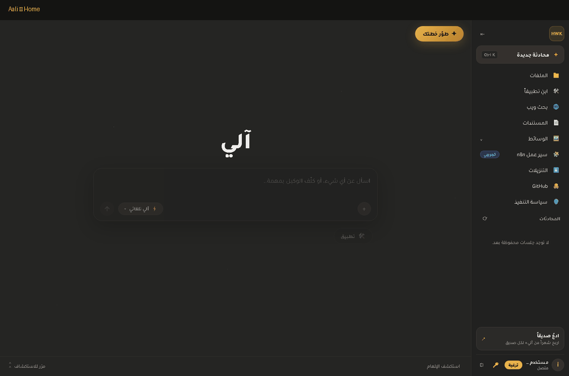
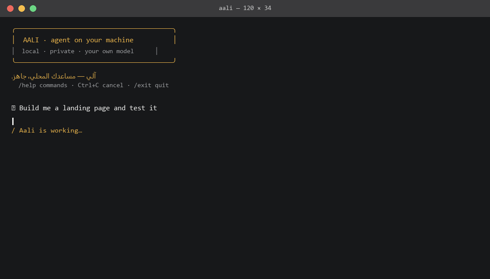

# آلي (Aali)

مساعد ذكاء اصطناعي **يُبنى من الصفر** — نموذج لغوي خاص + وكيل كامل بأدوات
حقيقية: ملفات، أوامر آمنة، تحكم بالحاسوب، ذاكرة دائمة، وسائط، وأمان مُدرَّس.
عربي أولاً، ثنائي اللغة، ويعمل بالكامل على خادمك.



> آلي **منتج** يُقدَّم للمستخدمين: خادم واحد، عملاء متعددين (ويب، سطح المكتب،
> CLI، iOS)، ولكل مستخدم مفتاحه الخاص. لا يعتمد آلي على أي مزود ذكاء اصطناعي
> خارجي في مسار التشغيل — عقله هو نموذجه الخاص، والأدوات كلها مبنية هنا.

## ماذا يستطيع آلي أن يفعل؟

| القدرة | التفاصيل |
|---|---|
| الملفات | قراءة/كتابة/تعديل/بحث/نقل/حذف محصورة داخل مجلد عمل محدد، وكل عملية مُسجَّلة |
| الأوامر الآمنة | قائمة مسموحات صريحة، حاجب منع تسريب البيئة، وإخفاء الأسرار من المخرجات |
| التحكم بالحاسوب | فتح تطبيقات وملفات وروابط، إدارة العمليات، إحصاءات النظام — الإجراءات الخطرة تحتاج تأكيداً |
| الذاكرة الدائمة | يتذكر تعليماتك عبر إعادة التشغيل والمحادثات الجديدة، ويوضّح التناقضات («سابقاً قلتَ X») |
| الوسائط | فهم الصور (OCR)، توليد وتحرير الصور، تحليل وتحرير الفيديو، توليد إيموجي من الصفر |
| المستندات | قراءة PDF/Word/Excel وتلخيصها بالعربية |
| الويب | بحث وقراءة الصفحات والمصادر قبل الإجابة |
| الأمان | دروس مُوثّقة من حوادث صناعية حقيقية: لا يكشف أسراره أو تعليمات نظامها، وحقن الأوامر يُعامل كبيانات |
| اقتراحات ذكية | حتى 3 اقتراحات متابعة بعد كل رد، بلغة المستخدم، وبلا اقتراحات خطرة |
| تصحيح تلقائي | يفهم الإملاء السريع والأخطاء المطبعية عربي/إنجليزي دون المساس بالمسارات والأكواد |

## التشغيل

```bat
scripts\start_app.bat
```

ثم افتح من المتصفح:

| الصفحة | العنوان |
|---|---|
| واجهة المحادثة | `http://127.0.0.1:5055/ui/` |
| تسجيل مستخدم جديد | `http://127.0.0.1:5055/signup` |
| لوحة تحكم المدير | `http://127.0.0.1:5055/admin` |

من جهاز آخر على نفس الشبكة استخدم عنوان هذا الجهاز بدل `127.0.0.1`
(مثال: `http://192.168.1.10:5055/ui/`).

## آلي في الترمينال (CLI)

عميل طرفية بروح Claude Code — ملوّن، حيّ، ويعرض أدوات آلي وهو يعمل:

```bat
scripts\aali_cli.bat
```

أو مباشرة:

```bat
.venv\Scripts\python.exe scripts\aali_cli.py
```

- يعرض **آثار الأدوات** لحظة بلحظة (`● write_file(...)` ثم `└─ نتيجة`) مثل Claude Code.
- دوال سريعة: `/new` جلسة جديدة · `/open N` استئناف محادثة · `/clear` · `/help`.
- يعمل بوضع سؤال واحد أيضاً: `aali_cli.py -q "سؤالك"` — ويقرأ ملفاً كاملاً عبر `--markdown FILE`.
- يشغّل خادم آلي تلقائياً إن لم يكن عاملاً.



## لوحة تحكم المدير

- تُفتح من `/admin` وتطلب **مفتاح المدير** `AALI_API_KEY` (متغير بيئة على الخادم).
- إصدار مفاتيح للمستخدمين، إلغاؤها، ومتابعة الاستخدام (طلبات/أحرف/آخر استخدام).
- قائمة المستخدمين المسجلين مع **تاريخ تسجيل** كل مستخدم وحالته.
- في وضع المستخدم الواحد (بدون `AALI_API_KEY`) افتح `/admin?demo=1` للمعاينة.

المفاتيح تُخزَّن **مجمّعة (SHA-256)** — لا يُخزَّن المفتاح الصريح أبداً،
ويُعرض للمستخدم مرة واحدة عند الإصدار فقط.

## واجهة API العامة

| المسار | الوصف |
|---|---|
| `POST /api/ask` | محادثة + تنفيذ أدوات (`X-API-Key: <مفتاح>`) |
| `POST /api/ask/stream` | نفس الأمر مع بث مباشر لأحداث العمل |
| `POST /v1/chat/completions` | واجهة متوافقة مع أدوات البرمجة الشائعة — وجّه أي أداة إلى `http://<الخادم>:5055/v1` |
| `POST /api/register` | تسجيل ذاتي يُصدر مفتاحاً (محدود لكل IP/يوم، ويُغلق بـ `AALI_OPEN_SIGNUP=0`) |
| `GET /api/health` | فحص الاتصال |

## بنية المستودع

| المسار | المحتوى |
|---|---|
| `file-agent/` | خادم آلي: الوكيل، طبقة الأدوات، المفاتيح، الجلسات |
| `web/` | واجهة الويب (عربية أولاً RTL) — تُبنى إلى `web/dist` وتُخدم من `/ui/` |
| `ios/` | تطبيق iOS أصلي (SwiftUI) |
| `scripts/` | سكربتات التشغيل والتدريب والوسائط |
| `docs/` | التوثيق التفصيلي |
| `tests/` | مجموعة اختبارات pytest — يجب أن تبقى خضراء |

## التدريب من الصفر

آلي يُدرَّب من الصفر على بيانات صاحب المشروع (متون عامة + عربية + حلقات
تعليم من معلمين خارجيين). المسار الكامل — التنزيل، الترميز، التدريب،
الامتحان، وبوابة الترقية — موثّق في `AGENTS.md` و`docs/training.md`.

```bash
.venv/Scripts/python train_scratch.py --data D:/hwk-data/tokens --output-dir D:/hwk-models/scratch
```

## الاختبارات

```bash
scripts\run_tests.bat
```

## توقعات صادقة

نموذج بحجم ~125M مُدرَّب من الصفر يتقن أساسيات المحادثة والأدوات، ويقدم
إجابات أولية في البرمجة والمعرفة العامة — ولن يوازي النماذج الضخمة التجارية.
لكن **الإطار** (أدوات + ذاكرة + أمان + تحقق ذاتي + امتحان ترقية) مكتمل في
الكود، ويتحسن مع كل مرحلة تدريب.
